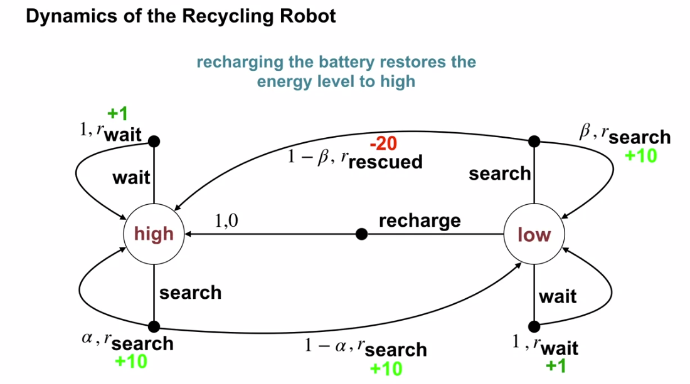
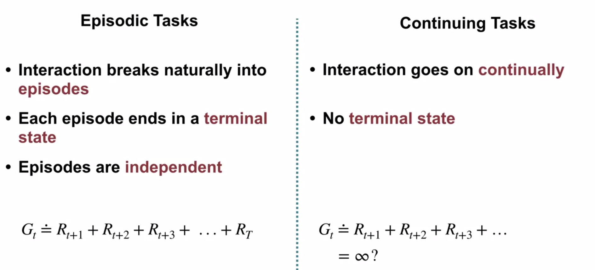
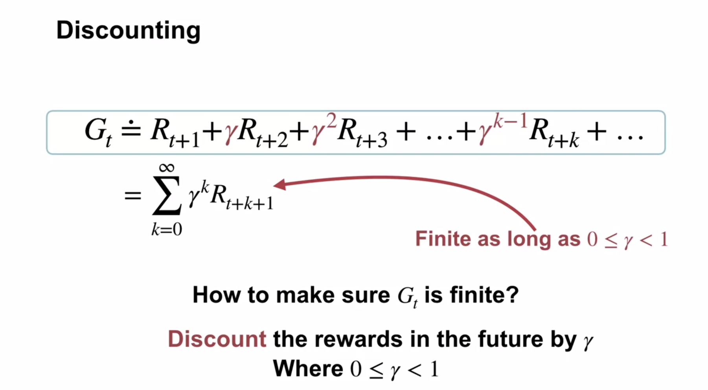
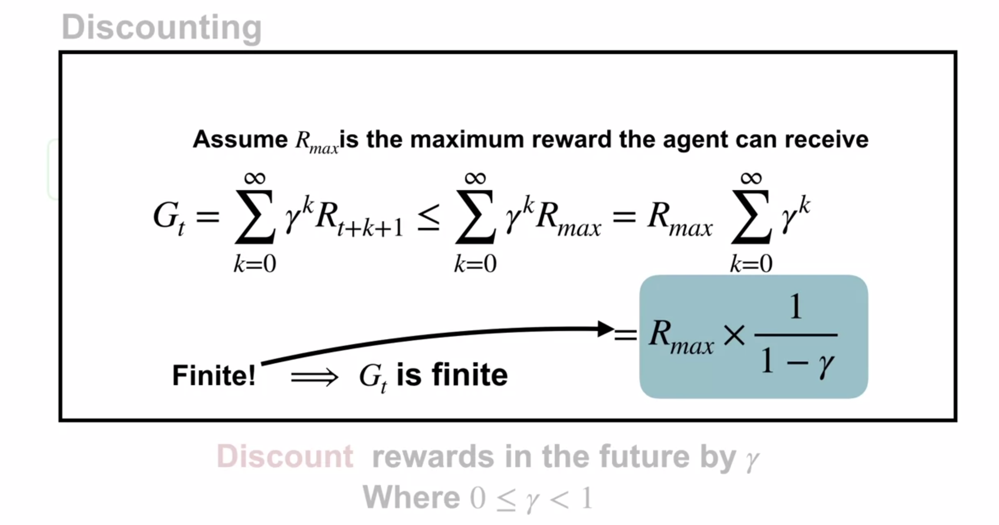
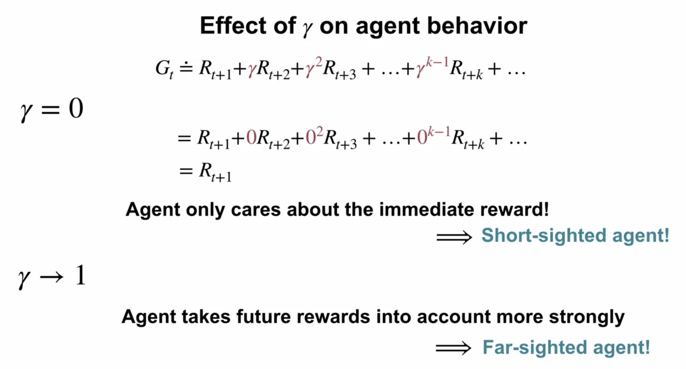
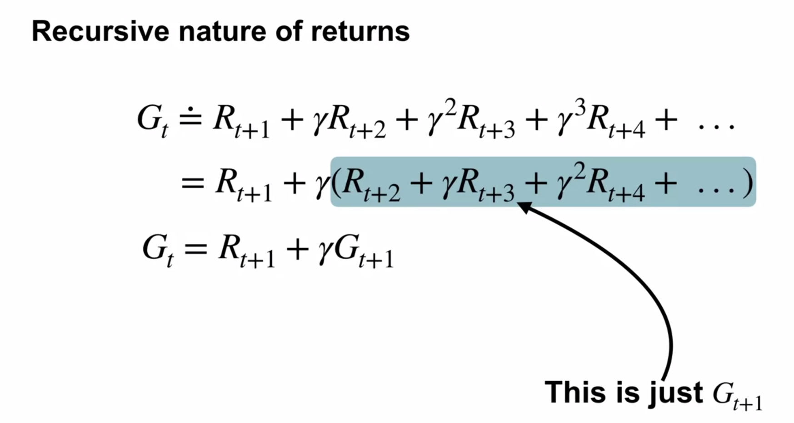

# Week 2: Fundamentals of Reinforcement Learning

## Markov Decision Processes

Bandits don't really represent many aspects of real-world problems: the agent is presented with the same situation and each time and the same action is always optimal.

### Reward hypothesis

* Give a man a fish and he'll eat for a day - traditional programming
* Teach a man to fish and he'll eat for a lifetime - supervised learning
* Give a man a need for fish and he'll figure it out - reinforcement learning

Reward hypothesis: "All goals can be described by the maximisation of expected rewards."

If accepting the hypothesis, then there are two areas need to be addressed:

* What rewards should agents optimise?
* Designing algorithms to maximise them

It can be difficult to express some rewards... eg aircon costs money, but no aircon costs discomfort... how to balance these two?

Rewards can be expressed as a final goal, or no goal yet:

Goal achieved = +1, and everything else is 0.  Downside: no urgency.

Alternatively, *action-penalty representation*: a -1 could be awarded every step that the goal is not yet achieved.  Problems if there is a small probability of getting stuck and never reaching the goal.

Both schemes have big problems with goals with really long horizons.  Smaller intermediate rewards pointing the agent in the right direction would be really helpful.

Where do rewards come from?
* Programming
  * Coding: Write a program that takes in states and outputs rewards.  Temporal logic is a special language for specifying tasks.
  * Human-in-the-loop: Humans give rewards differently to functions, so this needs to be dealt with.  Humans tend to change the reward based on how the agent is learning. Standard algorithms don't respond well to this kind of non-stationary reward.
* Examples
  * Mimic reward: copy the rewards that a person gives
  * Inverse reinforcement learning: trainer demonstrates desired behaviour, then learner figures out what rewards trainer must been maximising to make this behaviour optimal.  These rewards can be maximised in other settings allowing for powerful generalisation between environments.
* Optimisation:
  * Evolutionary optimisation: if we can create a score for a high-level behaviour, an optimisation approach can search for that behaviour.  We run multiple agents pursuing a goal, and evaluate not only the result, but also the rewards which are used as an incentive for the winning behaviour.  Agents (including living ones) survive if they have good rewards and a good algorithm for maximising them, and pass those along to their offspring.
  * Meta RL: The above is an example of learning at the meta level that creates better ways of learning at the individual level

Challenges to the hypothesis:
* Target is something other than cumulative reward:
  * Agent is doing something other than maximising reward.  It's not immediately apparent how to capture risk-adverse behaviour in this framework. (Getting a lower reward on average, but lowering the possibility of the worst-case outcome).  Or maybe it can be captured by magnifying negative outcomes.
  * Diversity in behaviour: music chooser shouldn't play my favourite song all the time.  Maybe the reward is scaled back if the behaviour has been recently taken.
* Good match for high-level human behaviour?
  * Single-minded human reward pursuers aren't generally considered good people.
  * The goals we "should" be pursuing aren't immediately evident to us - we learn what it means to make good decisions as we age and understand ethics.  We learn more about our environment and our impacts on it.  In humans, part of this comes from discovering a deeper sense of purpose.  "Are we just identifying details of the reward functions that are already in our minds, or are we actually creating better goals for ourselves?"

Maximising rewards may just be an excellent approximation of what motivates intelligent agents.

What if we adjust our reward function as we begin to see that the old function is missing collectable rewards, or collecting avoidable penalties?

How do we see reward or penalty differently to the way that we currently see it?  What environment cues tell us that our reward function is skewed?  In me, it's usually pain/shame...  Perhaps there needs to be an input from the other agents in the environment (all "civilised" agents sharing an overall reward) - if an agent is receiving too many negatives from its environment, or causing too many, it could either shut itself down, or be disabled by its surrounding agents.

Maximising reward may just be an excellent approximation of what motivates intelligent agents.

### Continuing tasks

The 2nd last equation is a converging geometric series when $0 \le \gamma \lt 1$, which evaluates to the final equation.

This important formula will be used a lot in the future.

Reward at termination time step $G_T$ is defined as 0.

## Textbook reading

MDPs formulate sequential decision making, where actions influence not just immediate rewards, but also subsequent situations, or states, and future rewards.

There is a need to trade off immediate vs long-term rewards.

In bandits, $q_*(a)$ was the value function, as a single action yielded a reward, and then state reset to an initial starting position.

In MDPs the value of an action is $q_*(a, s)$ denoting that the values of actions depend also upon the context of the state in which they are taken.

The value of a particular state is denoted $v_*(s)$, the total cumulative (possibly discounted) reward of that state, *given optimal actions*.

### 3.1 Agent-Environment interface

An action has the environment transition to a next state, and the reward is associated with the *next* state's time step.  Action $A_t$ gives $R_{t+1}$.

I.e. action $A_{t-1}$ was taken in previous state $S_{t-1}$, and the environment provided us with current $S_t$ and $R_t$.

The initial state is $S_1$.  The special terminal state at $t_T$ is assumed to have reward of $0$.

A single function, $p(s', r | s, a)$ defines the dynamics of an MDP.

$$p(s',r|s,a) \doteq Pr\{S_t=s', R_t=r \big| S_{t-1}=s, A_{t-1}=a\} \tag{1}$$

The probability depends *only* on $s$ and $a$, meaning that any historical context on which the future depends must be encoded in $s$, and if it does encode it, $s$ is said to have the Markov property.

For a given $s$ and $a$, the probabilities sum to $1$:

$$\sum_{s'\in S}\sum_{r\in R}p(s',r|s,a) = 1 $$

We can then derive the following 3 formulae:

$$p(s'|s,a) \doteq \sum_{r\in R}p(s',r|s,a)$$

$$r(s,a) \doteq \mathbb{E}[R_t|s,a] = \sum_{r\in R}r\sum_{s'\in S}p(s',r|s,a)$$

Above is the weighted sum of reward (multiplied by probability of that reward).

$$ r(s',a,s) \doteq \mathbb{E}[R_t|s',a,s] = \sum_{r\in R}r\frac{p(s',r|s,a)}{p(s'|s,a)}$$

In general, actions can be any decisions we want to learn how to make, and the states can be anything we can know that might be useful in making them.

The motors and mechanical linkages of a robot and its sensing hardware should usually be considered parts of the environment rather than parts of the agent.

Rewards, too, presumably are computed inside the physical bodies of natural and artificial learning systems, but are considered external to the agent.

The general rule we follow is that anything that cannot be changed arbitrarily by
the agent is considered to be outside of it and thus part of its environment.

Rewards are always single numbers.

We always consider the reward computation to be external to the agent because it defines the task facing the agent and thus must be beyond its ability to change arbitrarily.

### 3.2 Goals and rewards

An agent's goal is to maximise the cumulative future reward.

Using a reward signal to formalise a goal is one of the most distinctive features of RL.

The reward signal doesn't tell an agent *how* to do reach the goal, but rather *what* we want to to achieve. (Use initial values of policy or value functions for hinting at the *how*).

### 3.3 Returns and episodes

A new episode's start is independent of the terminal state of the previous one.

The cumulative expected reward is (also known as the goal or return objective):

$$ \begin{aligned}
G_t &= R_{t+1} + \gamma R_{t+2} + \gamma^2 R_{t+3} + ... 	\\
    &= \sum_{k=0}^{\infty} \gamma^k R_{t+k+1}
\end{aligned} \tag{3.8} $$

This infinite sum is finite as long as the sequences of rewards is bounded and $0 \le \gamma \lt 1$.

If $\gamma = 0$, the agent only maximises the immediate return, and with $\gamma = 1$, there is no discounting, allowing for an infinite reward.

If the rewards at each non-final time step is $0$, and only a single reward $R$ is given at the final time step, then this simplifies to $\gamma^KR$ where $K$ is the number of timesteps to $t_T$.

Discounting:
- eliminates infinite returns
- encodes uncertainty about future rewards
- adjusts preference for immediate vs delayed rewards

All states plus terminal states are denoted: $S^+$.

Ex 3.10, proof of Eq 3.10:
$$\begin{equation*} G_t = \sum_{k=0}^\infty \gamma^k = lim_{n \rightarrow \infty} (1 + \gamma + \gamma^2 + ... + \gamma^n) = lim_{n \rightarrow \infty} \frac{(1 + \gamma + \gamma^2 + ... + \gamma^n) (1 - \gamma)}{(1 - \gamma)} = lim_{n \rightarrow \infty} \frac{1 - \gamma^{n+1}}{1 - \gamma} = \frac{1}{1 - \gamma} \end{equation*}$$

[//]: # (This may be the most platform independent comment)
