# Week 3: Value Functions and Bellman Equations

## Value functions

The action value of a state is the expected return if the agent selects a given action, and then follows policy.

Value function summarises all possible futures by averaging over returns.

### Brief history of RL

Marvin Minsky 1959/60.  Harry Klopf recognised adaptive behaviour was being ignored as the focus had shifted to supervised learning.

The first digital neural network simulation by Farley and Clark (1954) was a RL system.  Their next paper Clark and Farley moved away from the roots of their original idea, and then by the time of the perceptron, the focus was on error correction.

Particularly influential was Minsky’s paper “Steps Toward Artificial Intelligence” (Minsky, 1961), which discussed several issues relevant to trial-and-error learning, including prediction, expectation, and what he called the basic credit-assignment problem for complex reinforcement learning systems: How do you distribute credit for success among the many decisions that may have been involved in producing it? All of the methods we discuss in this book are, in a sense, directed toward solving this problem. Minsky’s paper is well worth reading today.

Minsky's thesis at Princeton was a RL physical system about a maze [SNARC](http://cyberneticzoo.com/mazesolvers/1951-maze-solver-minsky-edmonds-american/)

Barto and Sutton wrote papers on assocative search networks (combination of association and trial and error).  Search for something that works and then remember it.  Memoisation - remember the result from last time rather than having to recompute it.

RL at its roots is memoised context-sensitive search.

Harry had the idea of a distributed approach - [goal-seeking systems made up of goal-seeking components](https://dl.acm.org/doi/epdf/10.1145/1045236.1045237).
Generalised reinforcement - a unit could be reinforced by many types of signal.

Barto and Sutton disposed of one of the two core ideas of Klopf: that goal-seeking systems need to be made out of goal-seeking components.

### Bellman equations

These allow us to express a state-value or action-value in terms of their successors.

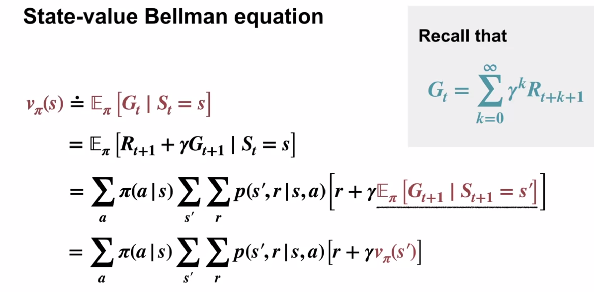

We can use the recursive definition as neither $\pi$ nor $p$ depend on time.

The magic of value functions is that they can be used as a stand-in for the average of an infinite number of possible futures.

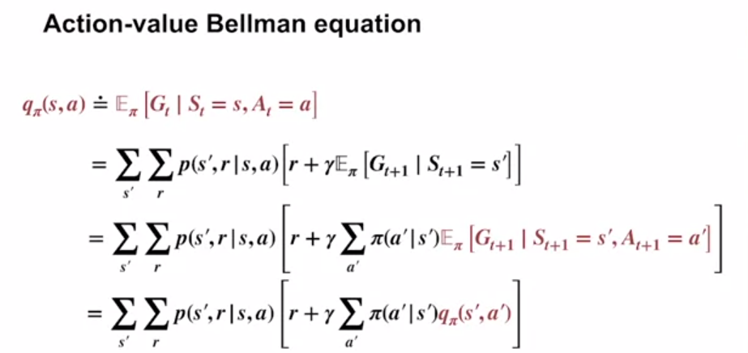

### Why Bellman equations?

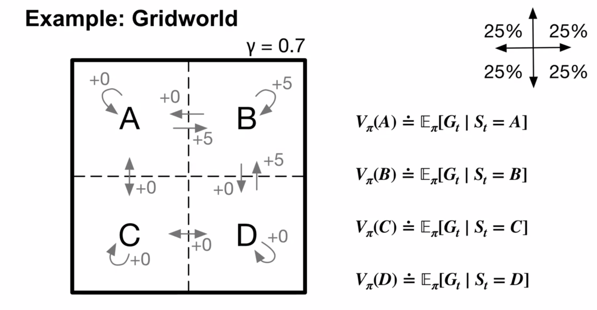

The value function is the expected return under policy $\pi$: an average over the return obtained by each sequence of actions that an agent could possibly choose (in infinitely many possible futures).

Policy is uniform random U,D,L,R movement.

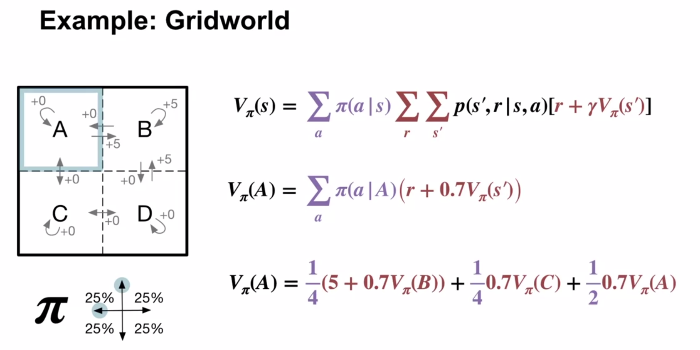

We can remove the sum over $r$ and $s'$ as for each action there is only one next state and reward.

In the 2nd equation, $s'$ and $r$ still depend on $s$ and $a$, but for notational simplicity this has been omitted.

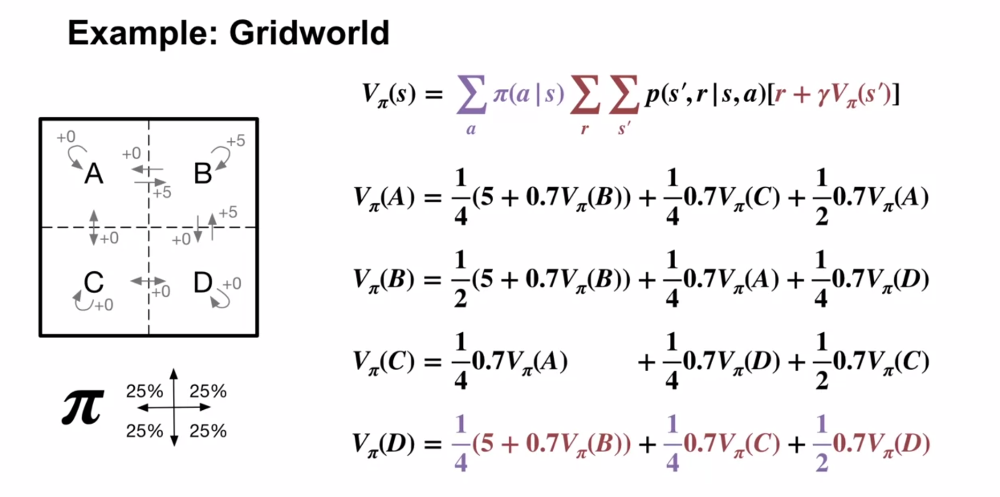

The value of each variable can be found as these are 4 simultaneous equations for 4 variables.

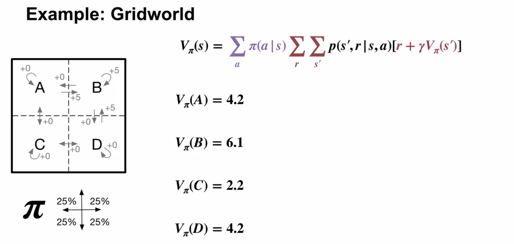

The Bellman equation reduced an unmanageable infinite sum over possible futures into a tractable linear algebra problem.

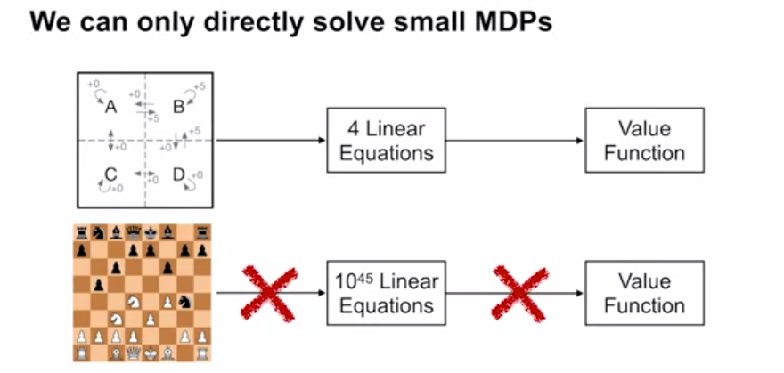

Bellman equations can be used for moderate sized MDPs, but are not practical for larger MDPs.

Later we learn algorithms based on Bellman equations which can scale up to large problems.

### Optimal policies

The goal of RL is to find an optimal policy - the one which finds maximum reward in the long run.

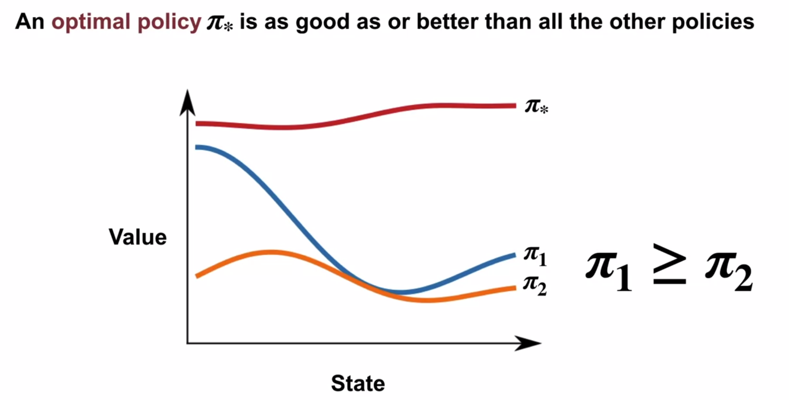

The line shouldn't be continuous as states are discrete not continuous, nor will the values change  smoothly across states.

Different policies will value states differently.

$\pi_1 \ge \pi_2$ or "$\pi_1$ is good as or better than $\pi_2$" means that for each state, $\
pi_1$ gives a value $\ge$ $\pi_2$.

There's always at least one optimal policy, but possibly more than one.

Policies can be combined to create a new meta-policy such that for each state, the best policy is selected.  Such a meta-policy is called an optimal policy, or $\pi_*$.

The optimal policy can have state values strictly greater than the individual policies it is created from, as the overall area under the curve is greater.

An optimal policy can ensure that it maximises return at every single time step, meaning that in the Bellman state-value equations, the probability weighting given by $\pi_*(a|s)$ will be maximum $=1$ for an action giving highest (or equal-highest) return. (Recall this probability was 0.25 in the Gridworld non-optimal policy example). In the Bellman state-value equation, the probability of $1$ is then multiplied by a maximum expected return (also discounted returns are added).  This will create state-values greater than an individual policy in the case where the best individual policy's probability of transition to the highest reward state was lower than $1$.
[(my answer posted here)](https://www.coursera.org/learn/fundamentals-of-reinforcement-learning/discussions/weeks/3/threads/W6aZN8TPEemx-wqBHs6BaA/replies/utda3pqXQ5KXWt6alwOSLg)

The optimal policy depends on the distribution of states that the agent will actually visit. Some policy might have great results (high state values) sometimes, but if the probability of reaching those states is low, then a different policy which has merely "good" results might be better, if the good outcomes tend to happen on average. [from here](https://www.coursera.org/learn/fundamentals-of-reinforcement-learning/discussions/weeks/3/threads/W6aZN8TPEemx-wqBHs6BaA).

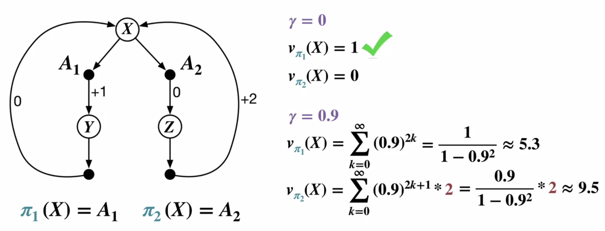

There are only 2 deterministic policies which are determined by the choice made in state $X$.

$\gamma^2k$ comes from every other (odd) power of $\gamma$ being multiplied by 0.
$\gamma^{2k+1}$ comes from every other (even) power of $\gamma$ being multiplied by 0.

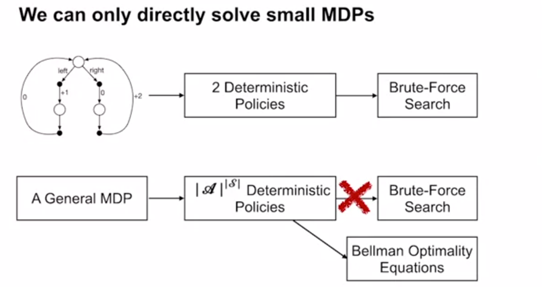

The exponential number of possible policies makes brute force search intractable.

### Optimal value functions

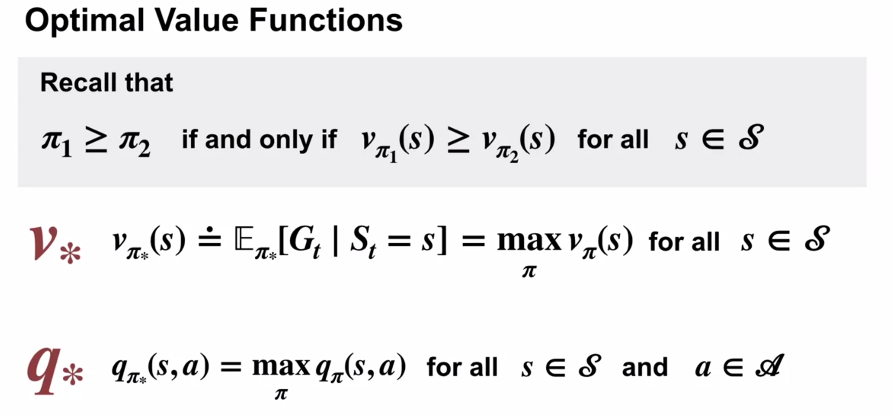

The Bellman optimality equations relate the value of a state or state-action pair to its possible successors under any optimal policy:

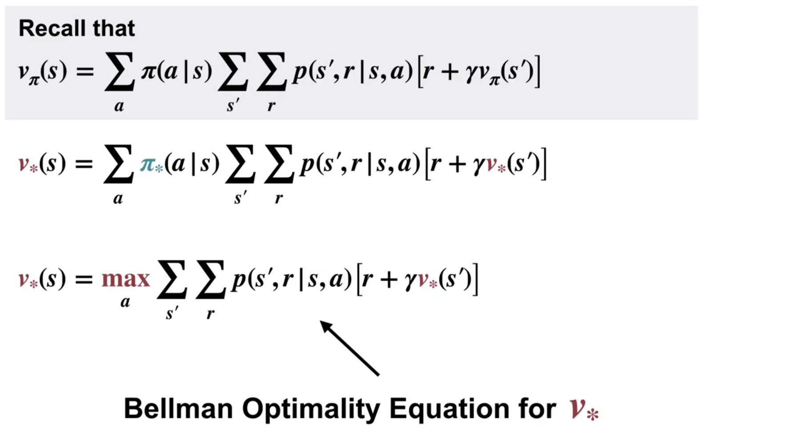

The sum over $\pi_*(a|s)$ can be exchanged with selection of the optimal action, as $\pi_*$ will deterministically select an optimal action with probability $1$.

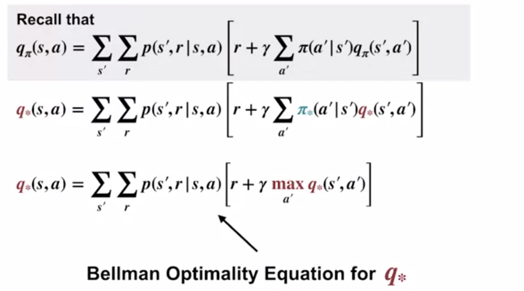

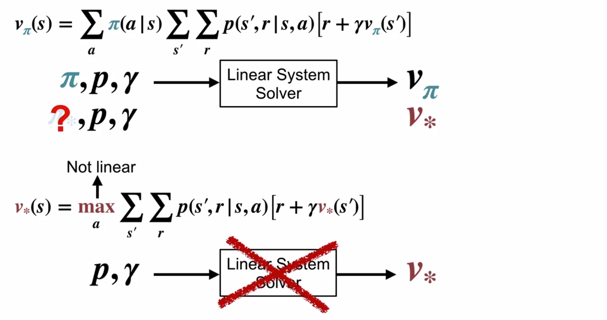
At the top, the bellman equations can be solved via simultaneous equations.

The Bellman optimality equations give a similar system of equations for the optimal value.
Getting the maximum over actions is not a linear operation, so linear algebra techniques won't help.

In this course we won't form and solve these equations in the usual way, rather we'll use other techniques based on the Bellman equations to compute value functions and policies.

We can't use $\pi_*$ in the ordinary Bellman equation to get a value for $v_*$ because we don't know $\pi_*$ (which is the goal of RL).

If we can solve the Bellman optimality equation for $v_*$, we can use the result to obtain $\pi_*$ fairly easily.

### Using optimal value functions to get optimal policies

Given an optimal value function, it's quite easy to find an associated optimal policy.

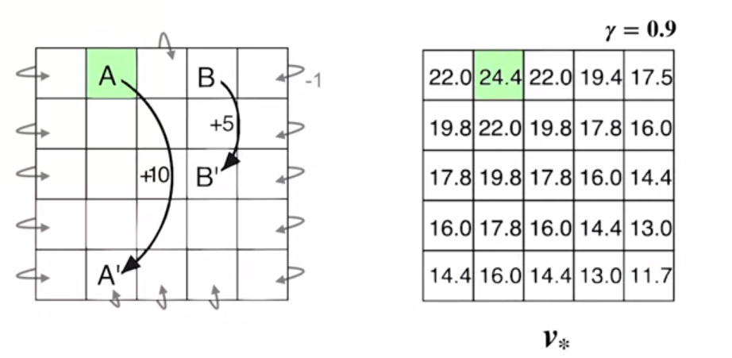

Unlike the uniform random policy, the optimal policy won't ever choose to bump into the walls, so the bottom row doesn't have negative values.  As a consequence, the immediate reward of state $A$ is much higher than +10.

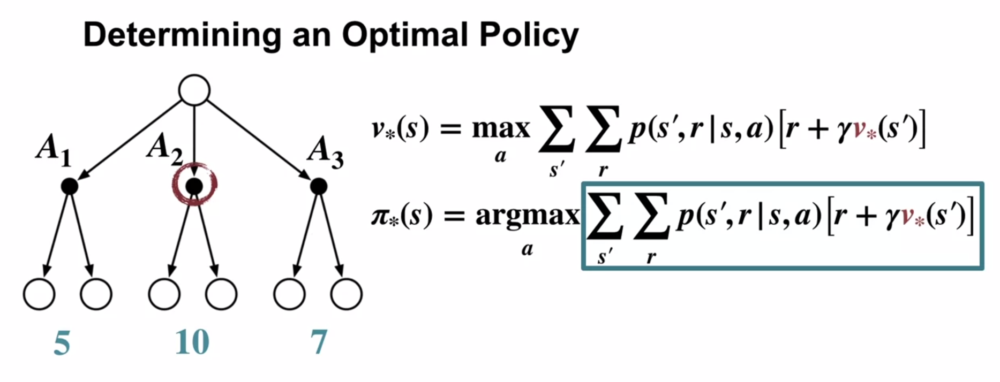

To evaluate the boxed term for a given action, we only need to perform a single step lookahead at the next states and values that follow.  The branching after the action shows captures stochastic transitions to next states.

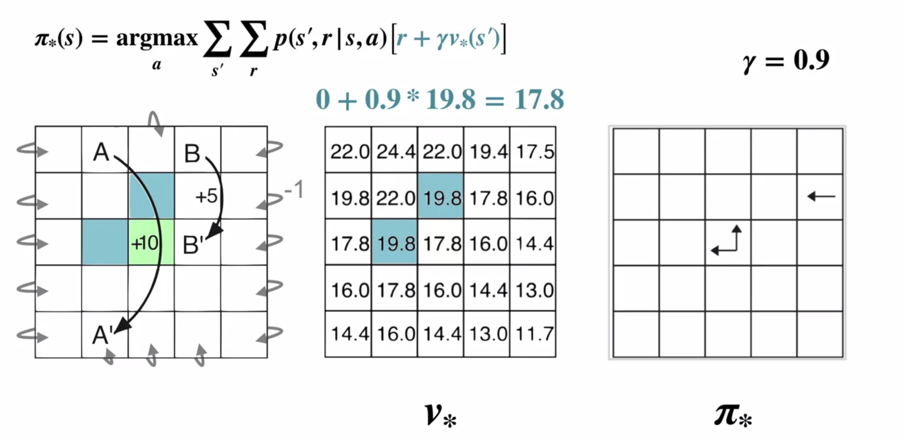

In this example, each action leads us deterministically to a single next state and reward.

We consider the square in green.  Given two equal maximum values, an optimal policy is free to pick either up or left with some probability.

We have also verified that $v_*$ obeys the Bellman optimality equation: for the maximising actions, the RHS of the equation evaluates to 17.8, equal to the value for the state itself.

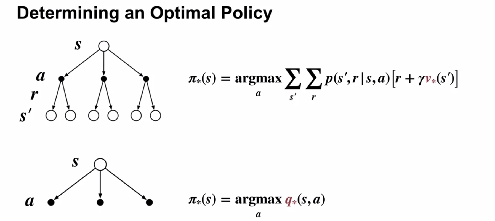

The action value function $q_*$ caches the results of a one step lookahead for action $a$ in state $s$.

If we have access to $q_*$, it's even easier to come up with the optimal policy:  there's no one-step lookahead, just choose the action which maximises $q_*$ given $s$.

Finding an optimal action-value function corresponds to finding an optimal policy.

### Summary

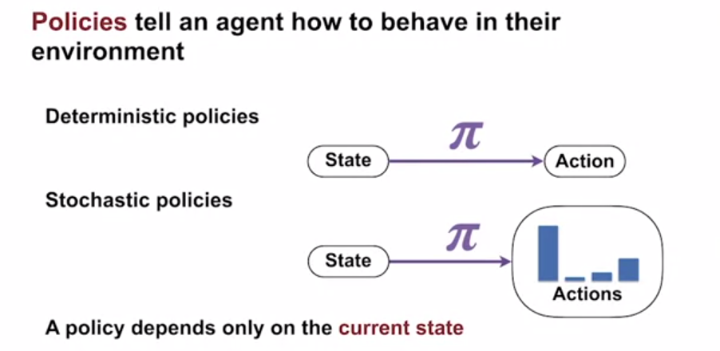
A deterministic policy has probability $1$ of selecting a single action given a state.

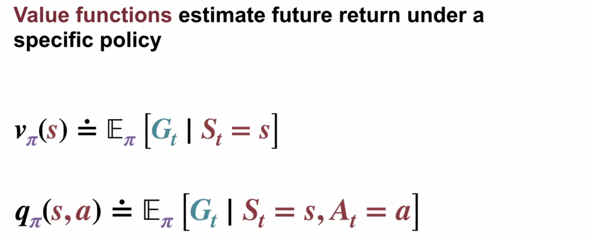
Value functions simply things by summarising many possible future returns into a single number.

$q_\pi$ is the value of selecting $a$, then afterwards following $\pi$.

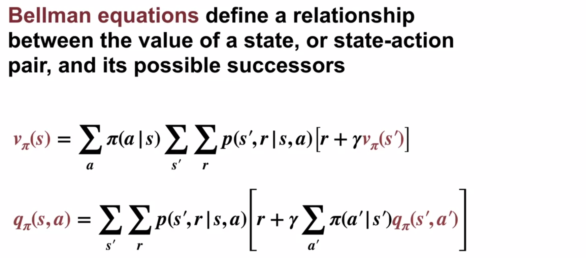

The Bellman state-value equation gives the value of a state as a sum over the values of all successor states and intermediate rewards.

The Bellman action-value equation gives the value of a state-action pair as a sum over the values of all possible next state-action pairs and rewards.

To find a policy which maximises reward, we define:
* Optimal policies
* The optimal value function
* Bellman optimality equations

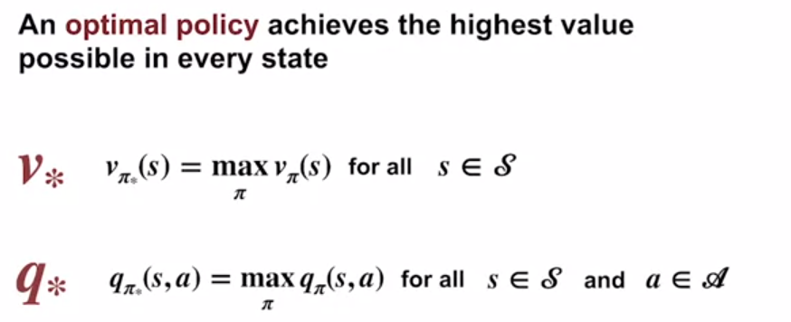

An optimal policy achieves the highest value possible in every state.  There is always *at least* one optimal policy.

Every optimal policy shares the same optimal state-value and action-value functions.

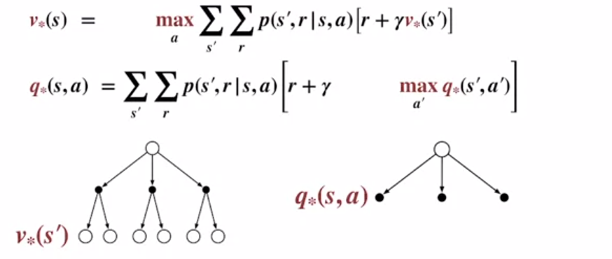

The Bellman optimality equations replace referencing a specific policy with a max over all actions, since the optimal policy must always select a best available action.

We can extract the optimal policy from the optimal state-value policy, but we also need the one-step dynamics of the MDP.

We can get an optimal policy with much less work from the optimal action-value function by selecting the action with highest value in each state.

Next week:  How to compute optimal policies using Bellman's equations.

## Quiz
1. S to prob actions
2. Update
3 True
4 Unique
5 Yes
6 No
7 simple max
8 r + gamma
9 0, 1
10 0,1 (choose!)

The optimal state-value function is unique in every finite MDP.

The Bellman optimality equation is actually a system of equations, one for each state, so if there are N states, then there are N equations in N unknowns. If the dynamics of the environment are known, then in principle one can solve this system of equations for the optimal value function using any one of a variety of methods for solving systems of nonlinear equations. All optimal policies share the same optimal state-value function.

Adding a constant to the reward signal can make longer episodes more or less advantageous (depending on whether the constant is positive or negative).  In continuing tasks, the agent will accumulate the same amount of extra reward independent of its behaviour.

We don’t need $\pi$ or $p$ to express  $v_∗$ in terms of $q_∗$. Under an optimal policy, the value of a state is the same as the values of the actions supported by the policy at that state.

$\pi_*$: the probability of taking an action is constrained between 0 and 1.

Real quiz:

Mean, sufficient

[//]: # (This may be the most platform independent comment)

# Deleteme:
[Textbook webpage](http://incompleteideas.net/sutton/book/the-book.html)

Notes
* [Zubieta's handwritten course notes](https://drive.google.com/file/d/1-QgHag8tGLf5rflYVQixIqhjdW8a-Hdt/view)
* [FrancescoSaverioZuppichini](https://github.com/FrancescoSaverioZuppichini/Reinforcement-Learning-Cheat-Sheet) Reinforcement Learning Cheat Sheet
* [yashbonde](https://yashbonde.github.io/musings.html) - Chapters 2-6, incl exercises
* [micahcarroll](https://micahcarroll.github.io/learning/2018/05/17/sutton-and-barto-rl.html) - Chapters 2 and 13
* [j-kan](https://observablehq.com/@j-kan/reinforcement-learning-notes) - Chapter 3 onwards
* [indoml](https://indoml.com/2018/02/14/study-notes-reinforcement-learning-an-introduction/#lstd) Most chapters, images generated from latex
* [nathandesdouits](https://github.com/nathandesdouits/reinforcement-learning-notes) 1st Ed. Chapter 2 & 3 with numpy code

Textbook solutions

* [iamhectorotero - Chapter 1 to 3](https://github.com/iamhectorotero/rlai-exercises)
* [LyWangPX - Chapter 3 onwards](https://github.com/LyWangPX/Reinforcement-Learning-2nd-Edition-by-Sutton-Exercise-Solutions)
* [Weatherwax's 2008 solutions](http://fumblog.um.ac.ir/gallery/839/weatherwax_sutton_solutions_manual.pdf)

Possibly this:
https://towardsdatascience.com/the-complete-reinforcement-learning-dictionary-e16230b7d24e

