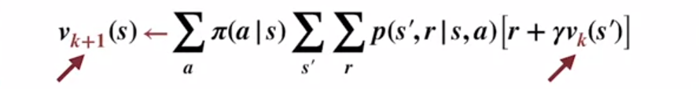

# Week 4: Dynamic Programming

## Learning objectives

### Lesson 1: Policy Evaluation (Prediction)

Policy evaluation is the task of determining the value function for a given policy.

Control is the task of finding a policy which gives as much return as possible (ie, maximises the value function).

Control is the ultimate goal of RL.  Policy evaluation is usually a necessary first step - it provides a metric for improvement.

Dynamic Programming solves both policy evaluation and control problems.

#### Understand the distinction between policy evaluation and control

Dynamic Programming uses the Bellman equations to define converging algorithms for policy evaluation and control.

Policy evaluation is the task of determing $v_\pi$ for a given policy $\pi$.

The Bellman state equation reduces the problem of finding $v_\pi$ to a system of linear equations, one for each state.

"Strictly better" when comparing policies means that the area under the state-value plot is greater:
* The policy is as good as or better, and:
* There is at least one state where the value is greater and not equal.

The goal of the control task is to modify a policy to produce one which is strictly better.

When this is no longer possible, it means there is no policy strictly better than the current policy, meaning the current policy is an optimal policy.

#### Explain the setting in which dynamic programming can be applied, as well as its limitations

Classical Dynamic Programming doesn't involve environment interaction (trial-and-error learning), it assumes complete knowledge of the MDP via $p$.

It uses the 4 Bellman equations with $p$ to iteratively work out value functions and optimal policies.

Most other RL methods can be seen as an approximation to Dynamic programming without $p$.  The difference is probably most striking in the temporal-difference based dyna-planning algorithm covered in course 2.

Dynamic programming solves both policy evaluation and control if we have access to the model's dynamics, $p$.

#### Outline the iterative policy evaluation algorithm for estimating state values under a given policy

Dynamic programming algorithms come from turning the Bellman equations into update rules.

#### Apply iterative policy evaluation to compute value functions

Instead of an equation that holds for the true value funciton, we have a procedure that we can apply until the equation holds.

A sweep is applying the above update $\forall s \in \mathcal S$.

Begin with an arbitrary initialisation for the value function, called $v_0$.  Each sweep of the update rule produces a better and better approximation of $v_\pi$.

When the update converges leaving the state-value function unchanged,  then we have evaluated $v_\pi$ for the current policy $\pi$.

This is because $v_\pi$ is the unique solution to the Bellman equation.  The only way the update could not make a change is if $v_k$ already obeys the Bellman equation.

When $v_{k+1} = v_k$ (equality not assignment) then replacing both terms with $v_\pi$ gives us the Bellman equation, and therefore the state-value function for policy $\pi$.

[//]: # (  )

# XXXXX Up to 2:15 time in video

### Lesson 2: Policy Iteration (Control)

Understand the policy improvement theorem

Use a value function for a policy to produce a better policy for a given MDP

Outline the policy iteration algorithm for finding the optimal policy

Understand “the dance of policy and value”

Apply policy iteration to compute optimal policies and optimal value functions

### Lesson 3: Generalized Policy Iteration

Understand the framework of generalized policy iteration

Outline value iteration, an important example of generalized policy iteration

Understand the distinction between synchronous and asynchronous dynamic programming methods

Describe brute force search as an alternative method for searching for an optimal policy

Describe Monte Carlo as an alternative method for learning a value function

Understand the advantage of Dynamic programming and “bootstrapping” over these alternative strategies for finding the optimal policy

## Value functions

# Quiz
1. >=
2. F
3. T
4. T
5. F
6. GPI only
7. All
8. F
9. T
10. Async
11. Model
12. -14
13. -15
14. NOT -21.   Incorrect. Try solving the equation 3/4 (x - 1) + 1/4 (-21) = x3/4(x−1)+1/4(−21)=x.

$$ \begin{align}
\end{align}$$

[//]: # (This may be the most platform independent comment)

# Deleteme:
[Textbook webpage](http://incompleteideas.net/sutton/book/the-book.html)

Notes
* [Zubieta's handwritten course notes](https://drive.google.com/file/d/1-QgHag8tGLf5rflYVQixIqhjdW8a-Hdt/view)
* [FrancescoSaverioZuppichini](https://github.com/FrancescoSaverioZuppichini/Reinforcement-Learning-Cheat-Sheet) Reinforcement Learning Cheat Sheet
* [yashbonde](https://yashbonde.github.io/musings.html) - Chapters 2-6, incl exercises
* [micahcarroll](https://micahcarroll.github.io/learning/2018/05/17/sutton-and-barto-rl.html) - Chapters 2 and 13
* [j-kan](https://observablehq.com/@j-kan/reinforcement-learning-notes) - Chapter 3 onwards
* [indoml](https://indoml.com/2018/02/14/study-notes-reinforcement-learning-an-introduction/#lstd) Most chapters, images generated from latex
* [nathandesdouits](https://github.com/nathandesdouits/reinforcement-learning-notes) 1st Ed. Chapter 2 & 3 with numpy code

Textbook solutions

* [iamhectorotero - Chapter 1 to 3](https://github.com/iamhectorotero/rlai-exercises)
* [LyWangPX - Chapter 3 onwards](https://github.com/LyWangPX/Reinforcement-Learning-2nd-Edition-by-Sutton-Exercise-Solutions)
* [Weatherwax's 2008 solutions](http://fumblog.um.ac.ir/gallery/839/weatherwax_sutton_solutions_manual.pdf)

Possibly this:
https://towardsdatascience.com/the-complete-reinforcement-learning-dictionary-e16230b7d24e

