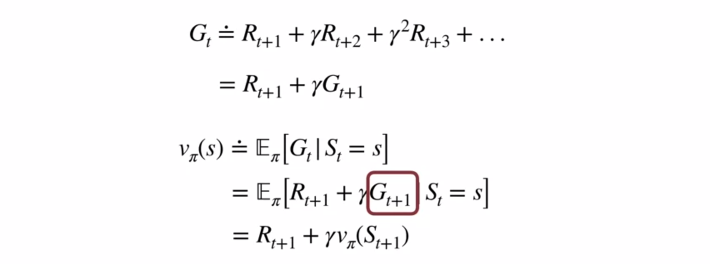
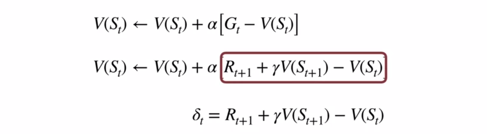
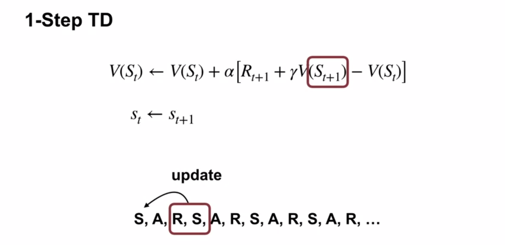
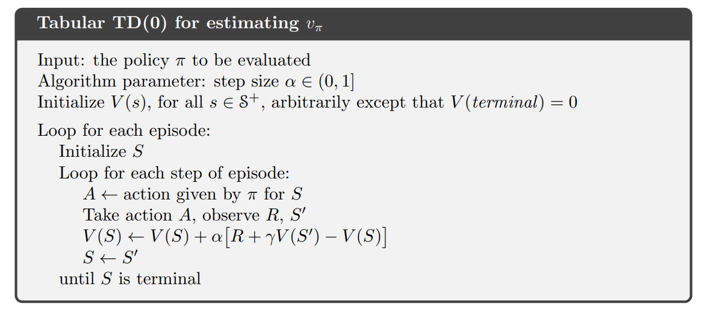
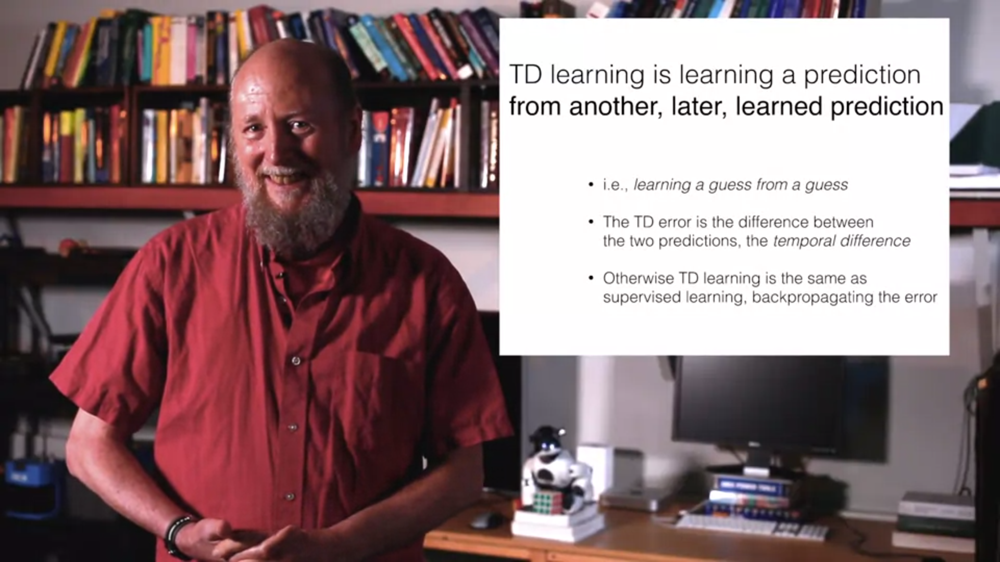
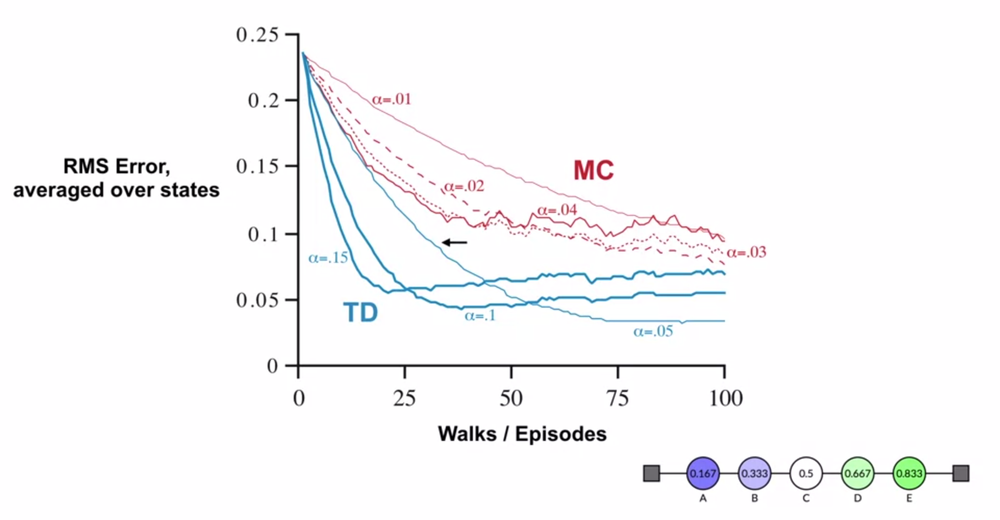

# Sample-based Learning Methods

# Week 3: Temporal Difference Learning Methods for Prediction

The differences between DP, MC, and TD are primarily in the prediction part of generalised policy iteration (GPI).

TD learning is the most central and novel idea in RL.

The special cases of TD methods introduced in chapter 6 should rightly be called one-step, tabular, model-free TD methods.

We can classify TD control methods according to whether they deal with this complication by using an on-policy or off-policy approach:

* Sarsa is an on-policy method.
* Q-learning is an off-policy method.  Expected Sarsa is also an off-policy method as presented here.

## Introduction to Temporal Difference Learning

### Temporal Difference Learning

The 2nd formula can be used to for an online update to the previous value of a state to form a Monte Carlo estimate without saving a list of returns to average.

Note the LHS of the red box is drawn over the `[` (right square bracket)

But $G_t$ (the MC update target) is the return from a full episode, meaning that we can't (yet) learn incrementally inside an episode.

Above we replace $G_{t+1}$ with a recursively-defined value from $v$.

The value of the next state is a stand-in for the value of the return until the end of the episode.  We don't need to wait until the end of the episode, but we do need to wait until the next step.

* The MC target is an estimate of the expected value (average of sampled return)
* The DP target is an estimate because $v_\pi(S_{t+1})$ is not known
* The TD target is an estimate for both reasons: a sample of the expected value of the reward, and the current estimate of $V_\pi(S_{t+1})$ rather than the true $v_\pi$.

Like with MC, the update is a sample update, based on a single observed next state, unlike DP's update which is based on the expected value from the complete probability distribution of next states.

MC targets generally have higher variance while TD(0) or one-step TD targets usually have lower variance.

### Temporal Difference Error

The highlighted terms are called the *TD error*, or $\delta_t$.  The first two of these are called the *TD target*.

TD updates its estimate of one state towards its own estimate of the next state.  As the estimated value of the next state improves, so does our TD target.

The TD error is depends on the next state and reward, and is only able to be calculated one step later in time.

### TD(0) algorithm

TD(0) is called one-step TD, and is a special case of TD($\lambda$) and $n$-step TD.

Assume we are are looking from the perspective of state $S_{t+1}$. We've stored the state of the previous time step to be able to make our update to it. We have also observed the reward in the current state, coming from the action taken within the previous state.  We discount the current state's value by $\gamma$, add the observed reward and then treat that sum as the observed value of the previous state.

In DP, we used the $p$ and $\pi$ to update based on all possible future states (and their transition returns).  Here we only use the next observed state and observed return.

### Richard S. Sutton - Temporal Learning

TD learning is specialised for prediction learning, making it the most important thing for AI in the century so far.

Methods that scale with computation are the future of AI.

Supervised learning and model-free RL methods are only weakly scalable.

Prediction learning is the most thoroughly *scalable* model-free learning.

Training sets and an objective are not required, just waiting for the outcome.

TD learning is a method specialised for learning to predict.

* Widely used in RL to predict future reward (value functions)
* Used in Sarsa, Q-learning, TD($\lambda$), Deep Q-learning, TD-Gammon, actor-critic methods, Samuel's Checker Player
  * (but not AlphaGo, helicopter autopilots, pure policy-based methods...)
* Seems to be how brain reward signals work
* Can predict any signal, not just reward

A series of predictions are made (after every time step), and we gradually find out what the correct answers were for the predictions when what actually happens is observed.

In prediction learning, as a parallel to supervised learning, the supervisor / labeller (telling the correct answer) is the environment. So prediction learning is the unsupervised supervised learning.

TD learning is learning from another, later, learned prediction.
* i.e., learning a guess from a guess
* The TD error is the difference between two predictions, the *temporal difference*.
* Otherwise TD is the same as supervised learning, back-propagating the error.

TD is only relevant for multi-step prediction learning (with information possibly revealed on each step).

Supervised learning is not prediction learning in that the label tells the correct prediction, rather than wait-and-see.

If the multi-step is a single step, then prediction reduces to the traditional supervised learning problem.

It's not possible to compose multi-step predictions from single-step predictions in practice: long-term predictions are exponentially complex and amplify small errors in one-step predictions.

We can see signals in the brain that correspond to the TD error.  Dopamine is the carrier in mammals, octopamine in bees.

Temporal difference learning is an important topic in both AI and in neuroscience and psychology (where it models and predicting behaviour).

### Advantages of TD learning

Like DP, TD can bootstrap.  Like MC, TD can learn directly from experience.

Unlike with MC, we don't need to wait until the end of an episode - we can update the value for the previous state as soon as we transition and observe the reward and next state.

Thus, TD can be used in continuing tasks, but MC can't.

MC must ignore or discount episodes where experimental actions are taken (the final return is used to update the state-action, rather than the reward).  TD learns from each and every transition, regardless of the subsequent actions taken.

Unlike DP, a model of the environment is is not required

Unlike both, the updates are online and fully incremental. TD updates as soon as it receives new information, making it useful in real-time settings.

TD asymptotically converges to the correct predictions, and usually does so faster than MC methods.

### Empirical differences

With MC, the final return propagates back all the way to the beginning (discounted by $\gamma$).

With TD, the update is only based on the difference between the estimated previous and discounted next-state values, and the return. If a reward is only given at the end of an episode, it propagates to only the penultimate state on the first episode, but on subsequent episodes, it will propagate back on any transition to any state that has been updated before.

The bottom right shows the random walk (policy is a coin toss of Left or Right in each state), with $\gamma = 1$, and no rewards =0 apart from a transition into the and right terminal state = 1.

[The video](https://www.coursera.org/learn/sample-based-learning-methods/lecture/CEzFc/comparing-td-and-monte-carlo) seems to use $\alpha=0.5$ as the updated state's value moves half way to the next state's value.

TD learned quicker and achieved a better final error.

TD generally converges faster than MC.

We could use a decaying $\alpha$ to achieve even better results.

### Barto and Sutton: More history of RL

Harry Klopf created a contract (not grant) at UMass to study if his theory of The Hedonistic Neuron made any sense.  Barto was hired as a post-doc. Michael Harvard/Harlem? said Harry required them to bring Rich Sutton on board.  Andy says he is risk adverse, and Sutton is risk-seeking.  Sutton says Barto is a contrare, wanting to go in the opposite direction to others. Barto says he went orthogonally in a sparsely covered field so he didn't need to keep up with the literature.  Barto left his tenure track position to be a post-doc, which Sutton says was risk taking :)

In the 60s, the first wave of ML turned into supervised learning.  In the 50s, there was interest in reward.  Barto says that even very astute people still confuse error correction and trial and error learning.

In the 80s, the advances in RL got overshadowed by the advances in supervised learning.  Also people thought that RL was too similar to behaviourism and threw the baby out with the bathwater.

Sutton hints at much behaviourist learning being lost, and a superpower coming from his understanding of the behaviourists, including the idea of TD learning.

Barto talks about intrinsic motivation in terms of research, rather than the nomadic researchers that flit from one hot topic to another.  Utility was not the driving force of the research, even though the utility turned out to be massive.

## Textbook notes

### 6.1 TD prediction

The MC error can be written as a sum of TD errors:

$$\displaystyle G_t - V(S_t) = \sum_{k=t}^{T-1} \gamma^{k-t} \delta_k $$

This assumes $V$ is not updated during the episode, but if the step size is small it will still hold approximately.

### 6.3 TD(0) Batch Updating; Optimality

In batch learning, all the recorded data is presented as a whole batch, after which $V$ is updated, until the method converges on an answer.

Updates are only done to $V$ after all data has been presented, with the incremental updates at each time step being accumulated until the end when $V$ is updated en masse.

TD(0) batch updating converges deterministically to a single answer regardless of the choice of $\alpha$ (as long as it is sufficiently small).

MC with constant $\alpha$ also converges deterministically under the same conditions, but to a different answer.

Under normal updating the methods do not move all the way to their respective batch answers, but in some sense they take steps in these directions.

Under batch training, constant-$\alpha$ MC converges to values, $V(s)$, that are sample averages of the actual returns experienced after visiting each state $s$.  These are optimal estimates in the sense that they minimize the mean-squared error from the actual returns in the training set.

$${\displaystyle \operatorname {MSE} ={\frac {1}{n}}\sum _{i=1}^{n}(y_{i}-{\hat {y_{i}}})^{2}.}$$

Where $\hat y$ is the mean value.

TD gets a lower error when measured by RMS error averaged over states.

$$ \displaystyle \operatorname {RMSE} ={\sqrt {\frac {\sum _{i=1}^{n}({\hat {y}}_{i}-y_{i})^{2}}{n}}}$$

Batch TD(0) gives the same answer as if the data were first modelled as a MDP, and then the state-values determined by DP.

Batch MC gives an answer based on the average of the backed-up observed returns only.

Monte Carlo method is optimal only in a limited way, and TD is optimal in a way that is more relevant to predicting returns.

MC batch updating gives a lower error based on the observed data, but TD batch updating gives a better estimate based on future expected data.

Batch Monte Carlo methods always find the estimates that minimize mean-squared error on the training set, whereas batch TD(0) always finds the estimates that would be exactly correct for the maximum-likelihood model of the Markov process. In general, the maximum-likelihood estimate of a parameter is the parameter value whose probability of generating the data is greatest.

Batch TD(0) converges to the certainty-equivalence estimate.

A certainty-equivalence estimate is formed based on the MDP created from the observed transitions and rewards: it assumes that the underlying process was known with certainty rather than being approximated based on observations.

Non-batch methods do not achieve either the certainty-equivalence or the minimum squared-error estimates, they can be understood as moving roughly in these directions. Non-batch TD(0) may be faster than constant-$\alpha$ MC because it is moving toward a better estimate, even though it is not getting all the way there. At the current time nothing more definite can be said about the relative efficiency of online TD and Monte Carlo methods.

My musing: is it possible to do batch replay of all observed episodes so far to get the best possible estimate for $v$, after each and every transition?  If there is enough compute, it could converge and an optimal policy determined before the time when the next action must be taken?

But no: With large state spaces, it's impossible: if $n$ is the number of states, then computing the maximum-likelihood of the process takes $n^2$ memory, and computing the value function takes $n^3$ computational steps if done conventionally.

What's amazing is that TD can approximate the same solution using memory no more than order $n$ and repeated computations over the training set.

[//]: # (This may be the most platform independent comment)
