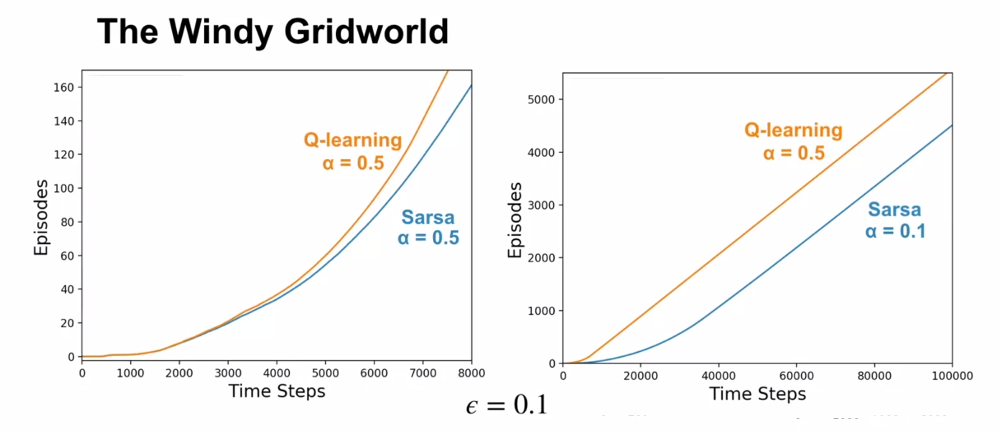
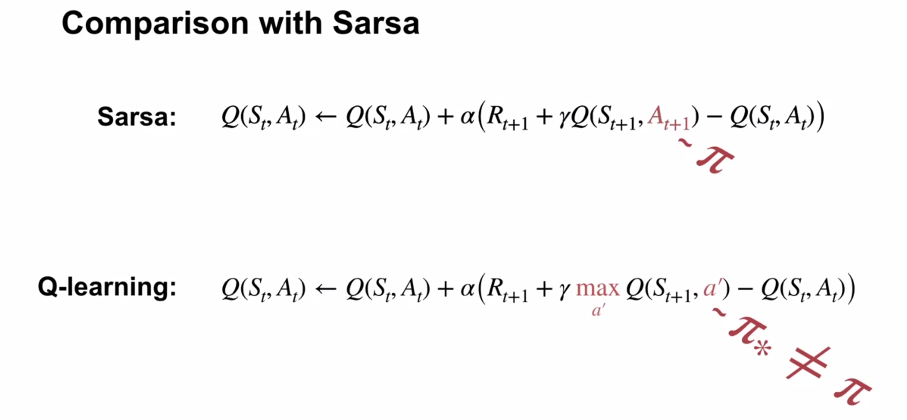
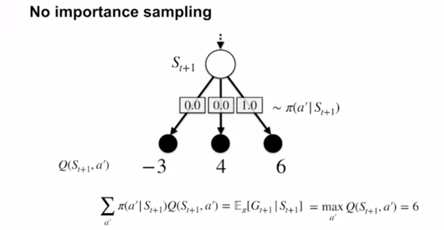
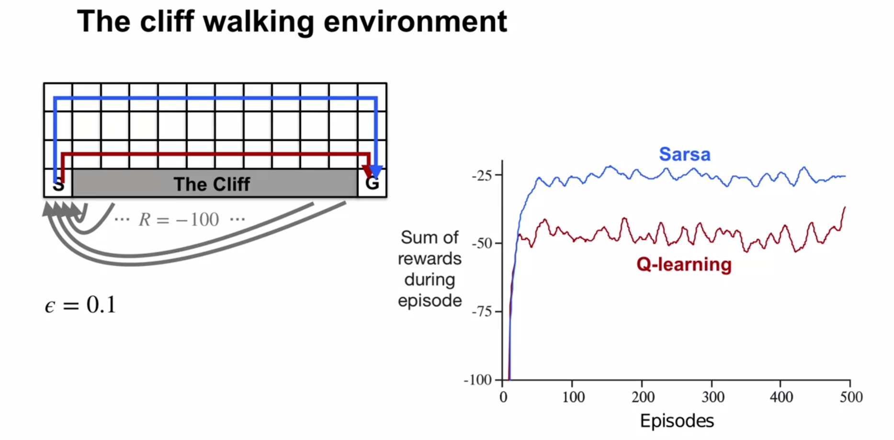
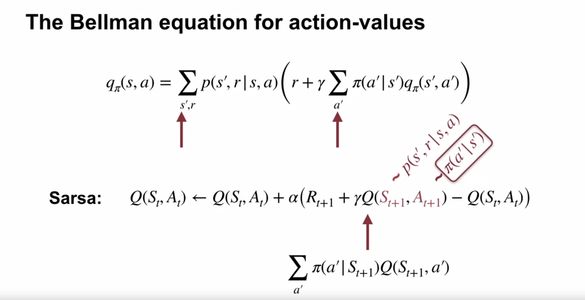
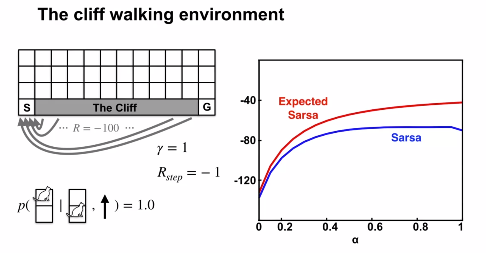
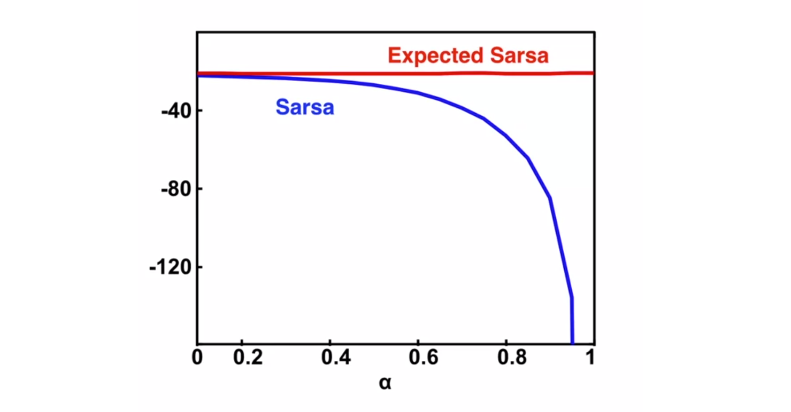
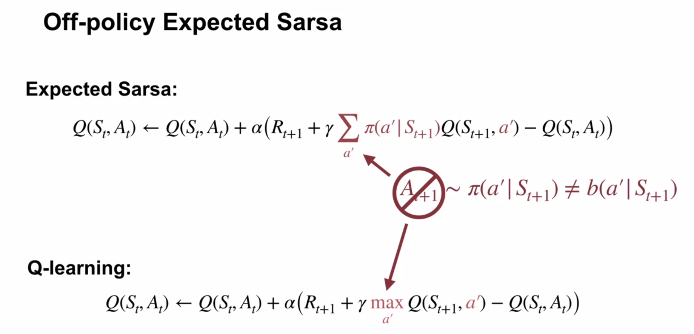

# Sample-based Learning Methods

# Week 4: Temporal Difference Learning Methods for Control

### Sarsa

Just like TD state value evaluation required the next state to be known so that it's estimate could be looked up, with Sarsa, the next (state, action) pair must be known to be able to be looked up.

Early episodes take many more timesteps to complete than later ones.  Around 7000 steps, the greedy policy stops improving.

The policy won't be optimal because it will continue to explore.

Monte Carlo wouldn't be a good fit - many policies don't lead to termination (eg constantly selecting "left").

Sarsa would (somehow!?) learn such policies are bad during the episode, and switch to another one during the episode.

Sarsa is a sample-based algorithm to solve the Bellman equation for action-values.

### Q-learning

Q-learning was developed in 1989 and was one of the first online RL algorithms.

Q-learning is a sample-based algorithm to solve the Bellman *optimality* equation for action-values.

Unlike Sarsa, it doesn't need the next action taken - it selects the best possible next action.

Because the optimality equation is used, $q_*$ is learned directly, eliminating the need for cycling between policy policy improvement / evaluation steps.

Sarsa is a sample-based version of policy iteration that which uses Bellman equations for action-values, that each depend on a fixed policy.

Q-learnng is a sample-based version of value iteration which iteratively applies the Bellman optimality equation, which always improves the action-value function (unless already optimal).

Just like value iteration will converge on the optimal solution, Q-learning will also converge to optimality as long as it continues to explore and samples all regions of the state-action space.

### Q-learning in the windy gridworld

Q-Learning directly learns the optimal policy's action-value function. Perhaps it is more stable - the update target is based on the max of the next action-values, so it only changes when one action is better than another.

Sarsa uses the next action (even if not optimal), as part of its update target.

With a smaller $\alpha = 0.1$, both perform equally (the gradients are parallel, episodes are comleted at the same rate).

### How is Q-learning off-policy?

How can Q-learning be off-policy without using importance sampling?

Sarsa is on-policy - it bootstraps based on the next action-value, which is determined by the current policy.  Evaluation is on the behaviour policy.

Q-learning is off-policy - it bootstraps on the best next action value, which may be different to the one of the current policy.  Evaluation is on an estimate of the optimal target policy.  It learns about the best action it could take, rather than the action actually taken (which we don't need to wait to know).

Whenever seeing a RL algorithm, a natural question to ask is:  "What are the target and behaviour policies?"

Q-learning's target policy is always greedy w.r.t. it's current values.  It's behaviour policy can be anything that continues to visit all state-action pairs during learning (eg, $\epsilon$-greedy).

If Q-learning is off-policy, why don't we see importance sampling ratios?  It's because the agent is estimating action values with a known policy.  It doesn't need importance sampling ratios to correct for the difference in action selection.  The agent can use $Q(S_{t+1}, a')$ and $\pi(a'|S_{t+1})$ to calculate an expected return.  Q-learning uses this technique to learn off-policy.  All non-maximal actions have probability $0$, so the expected return of a state is the same as the maximal action-value from that state.

Q-learning doesn't alternate between evaluation and improvements GPI steps, but rather learns the optimal policy directly.

There are some subtleties that make this less desirable in some specific situations.

Q-learning learns an optimal policy.  The optimal policy walks next to the cliff, but an exploratory action can give a hefty -100 reward.

Sarsa learns about its current policy, and takes into account $\epsilon$\-greedy action selection, and thus learns a longer but more reliable path further from the cliff.  Sarsa is able to reach the goal more reliably.

Learning off- vs on-policy can make for differences in control, depending on the task.

### Expected Sarsa

The Bellman equation for an action-value is a sum over next possible states, and the possible next actions in those states.

Sarsa estimates the Bellman expectation by sampling the next state from the environment, and the next action from it's policy.  But the agent already knows its policy, so why bother sampling a next action?  Why not compute the expected value directly?

Expected Sarsa computes a weighted sum of action-values to get the expected value of the next action.

The Expected Sarsa algorihm is the same as Sarsa, with the exception of the update target using the expected estimate of the next action-value rather than a sampled action-value.

There is a huge advantage in calculating the update target: Expected Sarsa has a more stable update target than Sarsa.

In this example, the immediate reward is always $1$.  Both types of Sarsa start out with the true action values of the next state.

Sarsa's update could be in the wrong direction, but eventually, in expectation across multiple updates, the direction is correct.

In contrast, Expected Sarsa's update targets are exactly correct, and don't change the estimated values away from the true values.

Expected Sarsa's update targets have a much lower variance than Sarsa's.

Expected Sarsa's decreased variance comes with a downside: as the number of actions increases, the time taken to compute the expected value increases.  This average needs to be computed every time step.

### Expected Sarsa in the Cliff World

Above, $\epsilon = 0.1$ was used in all cases.  100 episodes, averaged over 50,000 independent runs.

Expected Sarsa can use larger $\alpha$ values more effectively because it explicitly averages over the randomness due to its own policy.

The environment is deterministic, so Expected Sarsa's updates are deterministic for a given state and action.

Sarsa's updates can vary significantly depending on the next action.

Above, after 100,000 episodes both algorithms have learned everytthing that they're going to learn.

Expected Sarsa's long-term behaviour is unaffected by $\alpha$, because in this example updates are deterministic.  The step size only determines how quickly the estimates approach their target values.

As $\alpha$ decreases, Sarsa's long-run performance approaches Expected Sarsa's.

Summary: Expected Sarsa learns more quickly and is more robust to larger step sizes than Sarsa.

Sarsa and Expected Sarsa both approximate the same Bellman action-value equation.

### Expected Sarsa's off-policy learning

Expected Sarsa and Q-learning both use the expectation over their target policies in their update targets, meaning that importance sampling is not required.

The expectation over actions is calculated independently of the action actually selected in the next state, which can be taken based on a behaviour policy different to $\pi$.

### How Expected Sarsa's generalises Q-learning

If the target policy $\pi$ is greedy, then only the highest value action(s) are considered in the expectation, and the $\displaystyle \sum_{a'}$ will be the $\displaystyle \max_{a'} Q(a', S_{t+1})$, giving the same result as the Q-learning formula.

Q-learning is a special case of Expected Sarsa.

# TODO

* Write out all formulae to test understanding.

# ======

Lesson 1: TD for Control

Explain how generalized policy iteration can be used with TD to find improved policies

Describe the Sarsa Control algorithm

Understand how the Sarsa control algorithm operates in an example MDP

Analyse the performance of a learning algorithm

Lesson 2: Off-policy TD Control: Q-learning

Describe the Q-learning algorithm

Explain the relationship between q-learning and the Bellman optimality equations.

Apply q-learning to an MDP to find the optimal policy

Understand how Q-learning performs in an example MDP

Understand the differences between Q-learning and Sarsa

Understand how Q-learning can be off-policy without using importance sampling

Describe how the on-policy nature of SARSA and the off-policy nature of Q-learning affect their relative performance

Lesson 3: Expected Sarsa

Describe the Expected Sarsa algorithm

Describe Expected Sarsa’s behaviour in an example MDP

Understand how Expected Sarsa compares to Sarsa control

Understand how Expected Sarsa can do off-policy learning without using importance sampling

Explain how Expected Sarsa generalizes Q-learning

Module 4: Planning, Learning & Acting

Lesson 1: What is a model?

Describe what a model is and how they can be used

Classify models as distribution models or sample models

Identify when to use a distribution model or sample model

Describe the advantages and disadvantages of sample models and distribution models

Explain why sample models can be represented more compactly than distribution models

Lesson 2: Planning

Explain how planning is used to improve policies

Describe random-sample one-step tabular Q-planning

Lesson 3: Dyna as a formalism for planning

Recognize that direct RL updates use experience from the environment to improve a policy or value function

Recognize that planning updates use experience from a model to improve a policy or value function

Describe how both direct RL and planning updates can be combined through the Dyna architecture

Describe the Tabular Dyna-Q algorithm

Identify the direct-RL and planning updates in Tabular Dyna-Q

Identify the model learning and search control components of Tabular Dyna-Q

Describe how learning from both direct and simulated experience impacts performance

Describe how simulated experience can be useful when the model is accurate

Lesson 4: Dealing with inaccurate models

Identify ways in which models can be inaccurate

Explain the effects of planning with an inaccurate model

Describe how Dyna can plan successfully with a partially inaccurate model

Explain how model inaccuracies produce another exploration-exploitation trade-off

Describe how Dyna-Q+ proposes a way to address this trade-off

Lesson 5: Course wrap-up

# XXXXXXXXXXX

# Quiz
1. Greedy
2. optim action
3. state
4. optim action
5, Expected
6. Sarsa
7. T
8. T
9. F

[Textbook webpage](http://incompleteideas.net/sutton/book/the-book.html)

Notes
* [Zubieta's handwritten course notes](https://drive.google.com/file/d/1-QgHag8tGLf5rflYVQixIqhjdW8a-Hdt/view)
* [FrancescoSaverioZuppichini](https://github.com/FrancescoSaverioZuppichini/Reinforcement-Learning-Cheat-Sheet) Reinforcement Learning Cheat Sheet
* [yashbonde](https://yashbonde.github.io/musings.html) - Chapters 2-6, incl exercises
* [micahcarroll](https://micahcarroll.github.io/learning/2018/05/17/sutton-and-barto-rl.html) - Chapters 2 and 13
* [j-kan](https://observablehq.com/@j-kan/reinforcement-learning-notes) - Chapter 3 onwards
* [indoml](https://indoml.com/2018/02/14/study-notes-reinforcement-learning-an-introduction/#lstd) Most chapters, images generated from latex
* [nathandesdouits](https://github.com/nathandesdouits/reinforcement-learning-notes) 1st Ed. Chapter 2 & 3 with numpy code

Textbook solutions

* [yashbonde](https://yashbonde.github.io/musings.html) - Chapters 2-6, incl exercises
* [iamhectorotero - Chapter 1 to 3](https://github.com/iamhectorotero/rlai-exercises)
* [LyWangPX - Chapter 3 onwards](https://github.com/LyWangPX/Reinforcement-Learning-2nd-Edition-by-Sutton-Exercise-Solutions)
* [Weatherwax's 2008 solutions](http://fumblog.um.ac.ir/gallery/839/weatherwax_sutton_solutions_manual.pdf)

Possibly this:
https://towardsdatascience.com/the-complete-reinforcement-learning-dictionary-e16230b7d24e

[//]: # (This may be the most platform independent comment)
