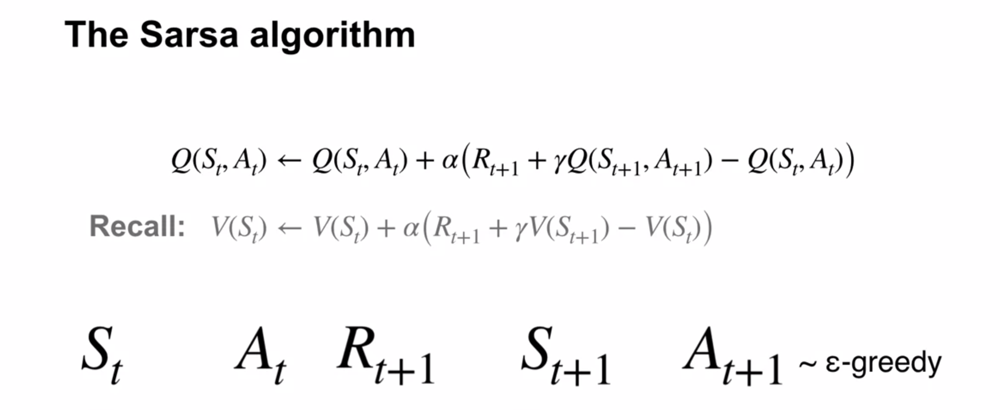
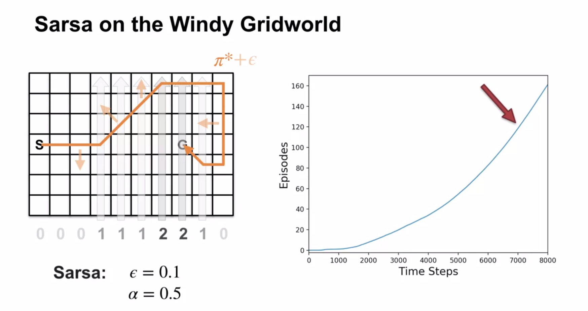
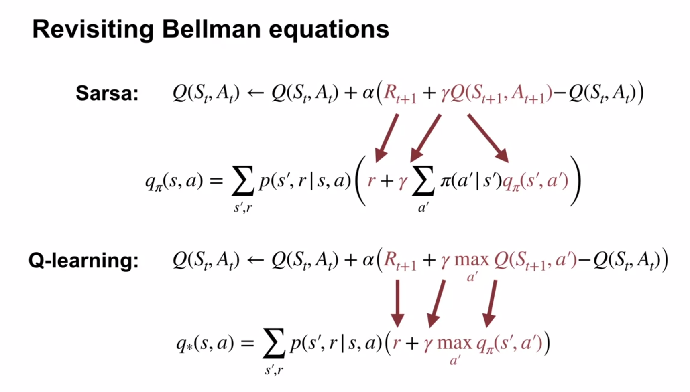

# Sample-based Learning Methods

# Week 4: Temporal Difference Learning Methods for Control

## Sarsa

Just like TD state value evaluation required the next state to be known so that it's estimate could be looked up, with Sarsa, the next (state, action) pair must be known to be able to be looked up.

Early episodes take many more timesteps to complete than later ones.  Around 7000 steps, the greedy policy stops improving.

The policy won't be optimal because it will continue to explore.

Monte Carlo wouldn't be a good fit - many policies don't lead to termination (eg constantly selecting "left").

Sarsa would (somehow!?) learn such policies are bad during the episode, and switch to another one during the episode.

Sarsa is a sample-based algorithm to solve the Bellman equation for action-values.

### Q-learning

Q-learning was developed in 1989 and was one of the first online RL algorithms.

Q-learning is a sample-based algorithm to solve the Bellman *optimality* equation for action-values.

Unlike Sarsa, it doesn't need the next action taken - it selects the best possible next action.

Because the optimality equation is used, $q_*$ is learned directly, eliminating the need for cycling between policy policy improvement / evaluation steps.

Sarsa is a sample-based version of policy iteration that which uses Bellman equations for action-values, that each depend on a fixed policy.

Q-learnng is a sample-based version of value iteration which iteratively applies the Bellman optimality equation, which always improves the action-value function (unless already optimal).

Just like value iteration will converge on the optimal solution, Q-learning will also converge to optimality as long as it continues to explore and samples all regions of the state-action space.

## Q-learning in the windy gridworld

Q-Learning is thought to learn faster as the update target is based on the max of the next action-values

# ======

Lesson 1: TD for Control

Explain how generalized policy iteration can be used with TD to find improved policies

Describe the Sarsa Control algorithm

Understand how the Sarsa control algorithm operates in an example MDP

Analyse the performance of a learning algorithm

Lesson 2: Off-policy TD Control: Q-learning

Describe the Q-learning algorithm

Explain the relationship between q-learning and the Bellman optimality equations.

Apply q-learning to an MDP to find the optimal policy

Understand how Q-learning performs in an example MDP

Understand the differences between Q-learning and Sarsa

Understand how Q-learning can be off-policy without using importance sampling

Describe how the on-policy nature of SARSA and the off-policy nature of Q-learning affect their relative performance

Lesson 3: Expected Sarsa

Describe the Expected Sarsa algorithm

Describe Expected Sarsa’s behaviour in an example MDP

Understand how Expected Sarsa compares to Sarsa control

Understand how Expected Sarsa can do off-policy learning without using importance sampling

Explain how Expected Sarsa generalizes Q-learning

Module 4: Planning, Learning & Acting

Lesson 1: What is a model?

Describe what a model is and how they can be used

Classify models as distribution models or sample models

Identify when to use a distribution model or sample model

Describe the advantages and disadvantages of sample models and distribution models

Explain why sample models can be represented more compactly than distribution models

Lesson 2: Planning

Explain how planning is used to improve policies

Describe random-sample one-step tabular Q-planning

Lesson 3: Dyna as a formalism for planning

Recognize that direct RL updates use experience from the environment to improve a policy or value function

Recognize that planning updates use experience from a model to improve a policy or value function

Describe how both direct RL and planning updates can be combined through the Dyna architecture

Describe the Tabular Dyna-Q algorithm

Identify the direct-RL and planning updates in Tabular Dyna-Q

Identify the model learning and search control components of Tabular Dyna-Q

Describe how learning from both direct and simulated experience impacts performance

Describe how simulated experience can be useful when the model is accurate

Lesson 4: Dealing with inaccurate models

Identify ways in which models can be inaccurate

Explain the effects of planning with an inaccurate model

Describe how Dyna can plan successfully with a partially inaccurate model

Explain how model inaccuracies produce another exploration-exploitation trade-off

Describe how Dyna-Q+ proposes a way to address this trade-off

Lesson 5: Course wrap-up

# XXXXXXXXXXX

# Quiz
1. Greedy
2. optim action
3. state
4. optim state
5, Expected
6. Sarsa
7. F\
8. T
9. F

[Textbook webpage](http://incompleteideas.net/sutton/book/the-book.html)

Notes
* [Zubieta's handwritten course notes](https://drive.google.com/file/d/1-QgHag8tGLf5rflYVQixIqhjdW8a-Hdt/view)
* [FrancescoSaverioZuppichini](https://github.com/FrancescoSaverioZuppichini/Reinforcement-Learning-Cheat-Sheet) Reinforcement Learning Cheat Sheet
* [yashbonde](https://yashbonde.github.io/musings.html) - Chapters 2-6, incl exercises
* [micahcarroll](https://micahcarroll.github.io/learning/2018/05/17/sutton-and-barto-rl.html) - Chapters 2 and 13
* [j-kan](https://observablehq.com/@j-kan/reinforcement-learning-notes) - Chapter 3 onwards
* [indoml](https://indoml.com/2018/02/14/study-notes-reinforcement-learning-an-introduction/#lstd) Most chapters, images generated from latex
* [nathandesdouits](https://github.com/nathandesdouits/reinforcement-learning-notes) 1st Ed. Chapter 2 & 3 with numpy code

Textbook solutions

* [yashbonde](https://yashbonde.github.io/musings.html) - Chapters 2-6, incl exercises
* [iamhectorotero - Chapter 1 to 3](https://github.com/iamhectorotero/rlai-exercises)
* [LyWangPX - Chapter 3 onwards](https://github.com/LyWangPX/Reinforcement-Learning-2nd-Edition-by-Sutton-Exercise-Solutions)
* [Weatherwax's 2008 solutions](http://fumblog.um.ac.ir/gallery/839/weatherwax_sutton_solutions_manual.pdf)

Possibly this:
https://towardsdatascience.com/the-complete-reinforcement-learning-dictionary-e16230b7d24e

[//]: # (This may be the most platform independent comment)
