# Prediction and Control with Function Approximation

We may not be able to store all the states in memory.  We may see a state only a single time.

The key issue here is generalization. How can experience with a limited subset of the state space be usefully generalized to produce a good approximation over a much larger subset?

Reinforcement learning with function approximation involves a number of new issues
that do not normally arise in conventional supervised learning, such as nonstationarity,
bootstrapping, and delayed targets. We introduce these and other issues successively over
the five chapters of this part.

Ch 9: The on-policy prediction case. The policy is given and only its value function is approximated.

Ch 10: The control case, in which an approximation to the optimal policy is found.

Ch 11: Off-policy learning with function approximation

In each of these three chapters we will have to return to first principles and re-examine the objectives of the learning to take into
account function approximation.

Ch 12: The algorithmic mechanism of eligibility traces, which dramatically improves the computational properties
of multi-step reinforcement learning methods in many cases.

Ch 13: Policy-gradient methods, which approximate the optimal policy directly and need never form an approximate value function (although they may be much more efficient if they do approximate a value function as well the policy).

## Lesson 1: Estimating Value Functions as Supervised Learning

### 9.1 Value function approximation
Given that there are generally far fewer weights than states, a change in a weight affects many states. A better state approximation by the function will also affect many other states, some negatively.

This generalisation is powerful, but can be difficult to manage and understand.

Partially observable environments can be modelled by having the weights not depending on the unobservable parts of the environment.

Memories of past observations can't be included in the state representation though.

Function approximation methods expect to receive input-output examples of the function to be approximated, a.k.a. the supervised learning training examples.

The most sophisticated artificial neural network and statistical methods all assume a static training set over which multiple passes are made. In reinforcement learning, however, it is important that learning be able to occur online, while the agent interacts with its environment or with a model of its environment.

To do this requires methods that are able to learn eciently from incrementally acquired data. In addition, reinforcement learning generally requires function approximation methods able to handle nonstationary target functions (target functions that change over time).  TD and DP both bootstrap, so the update targets are nonstationary.

### 9.2 Prediction Objective
When we make one state's estimation more accurate, we make other states' less accurate.  We need a way to know overall if we are moving in the right direction. We say which states we care most about via $\mu$, the weights of which sum to $1$, allowing for a *mean squared value error* objective function, $\overline{VE}$.

The square root of this is a rough measure of approximated value deviation from true values and is often used in plots.

Often $\mu(s)$ is the fraction of time spent in $s$.

### 9.3 Stochastic-gradient and Semi-gradient Methods

We assume that the example states appear with the same frequency as $\mu$. 

$\bf w$ is a column vector (all vectors are assumed to be column vectors unless written out horizontally or transposed).

### Understand how we can use parameterized functions to approximate value functions

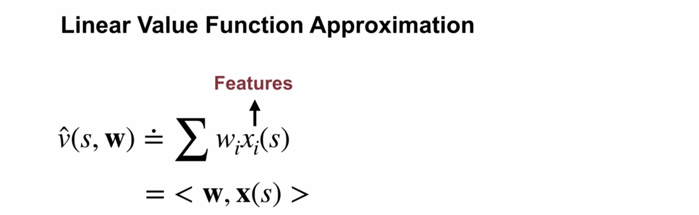
Compactly, the approximation is the inner product of the weights and feature vector of the state.

Our choice of feature limits the value functions we can represent.  We can only approximate functions that change linearly in terms of the features.  Consideration while constructing features may be necessary.

### Recognize that the tabular case is a special case of linear value function approximation

The tabular case is equivalent to a one-hot feature vector (=1 only on the nth element) matching the nth element of a weight vector which determines the value of the state.

### Understand that there are many ways to parameterize an approximate value function

$\hat v (s, \textbf{w}) \approx v_\pi(s)$, where $\bf w$ are the weights.

The function could be a neural network, decision tree, linear...

### Generalization and discrimination

Generalisation intuitively means applying knowledge about specific situations to draw conclusions about a wider variety of situations.
Updates to the value of one state also affect other states.

Generalisation speeds learning by making better use of the experience we've invested in gaining.  We may not need to visit a state as much, or at all.

How we determine which states are similar is a central topic of RL (and ML), and has a large impact on algorithmic efficiency.

Discrimination is the ability to make the values for two states different, to distinguish between two states.

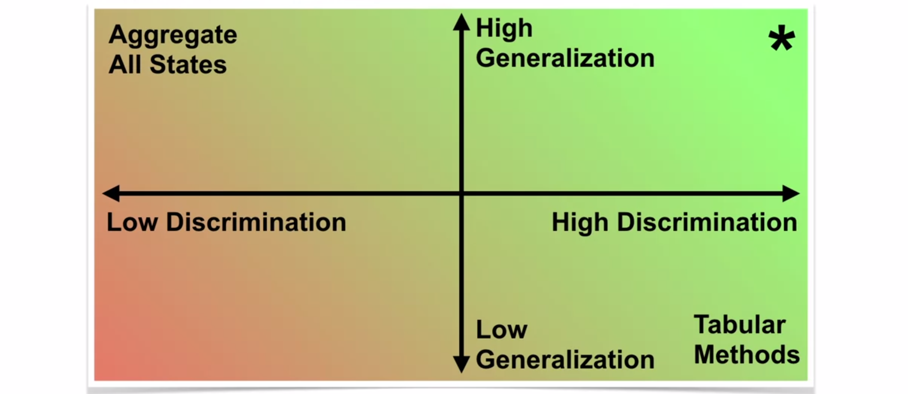

* Tabular methods perfectly discriminate, but have absolutely no generalisation.
* Aggregating all states (no discrimination) would allow (at best) an average to be learned.
* We want high generalisation AND high discrimination

### Value estimation can be framed as a supervised learning problem

The goal of supervised learning is to learn a function approximation based on (Input, Target) pairs.

Policy evaluation in RL can be framed similarly, eg, Monte-Carlo's (State, Return).

### Recognize not all function approximation methods are well suited for reinforcement learning

RL assumes an "online setting" where the agent is continually interacting with the world and gaining new experience, or (input, target) tuples.

In DL, the dataset is known before learning, and remains stationary while learning.

Some algorithms are also not designed for temporally correlated data, making them a poor choice for RL where this is always the case.

TD methods introduce the bootstrapping problem: targets depend upon our current estimates, and both continually change.  There is no "ground truth" label as a target, and the examples also change.

We need methods which work well with:
* online updating
* bootstrapping

## Lesson 2: The Objective for On-policy Prediction

#### Mean-squared value error objective

We need to be able to quantify which set of weights produce a better approximaion of the value of a state.

A natural choice is the squared error, or the squared (removes sign) difference between the value and estimation.

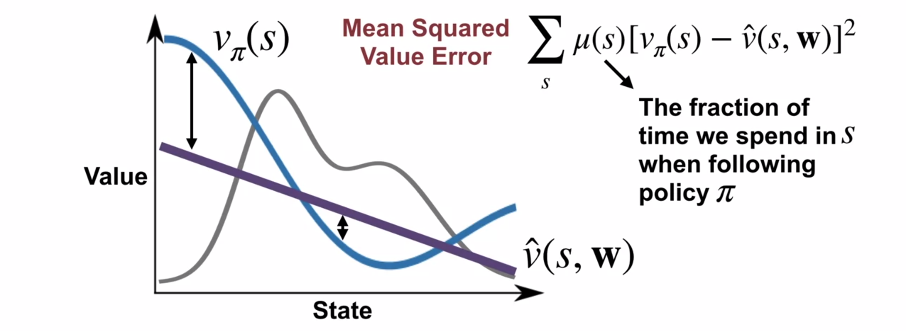

Making one state's estimate more accurate will often mean making another state less accurate.

$\mu(s)$ (shown in grey) denotes how much we care about the value of a particular state.  We want a closer approximation in common states and allow a higher error in states in which we spend little time.

We call this error $\overline{\text{VE}}$ or "V E Bar".

Our goal is to adjust the weights to decrease $\overline{\text{VE}}$.

#### Gradient descent

Gradient descent is a technique for finding a local minimum in a function by taking a step "down" the gradient.

The derivative of a function says in which direction to increase a value to increase the function.  We want to decrease the MSVE function, so will move in the opposite direction of the gradient.

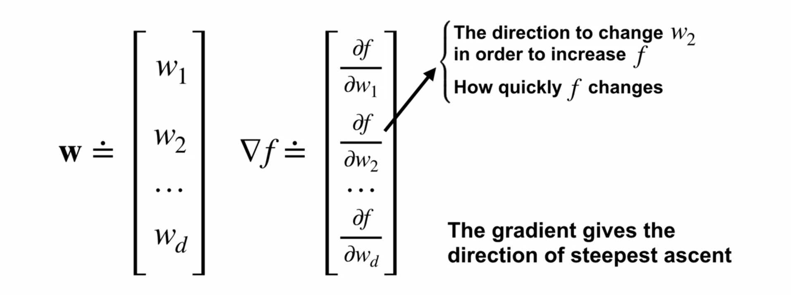

The gradient is a vector of partial derivitives, indicating how each value of $\bf w$ affects the function.

For a linear value function (inner product of weights and features) we get the result that the change in value function w.r.t the weights is based on the values of the state features that are multiplied by the weights:

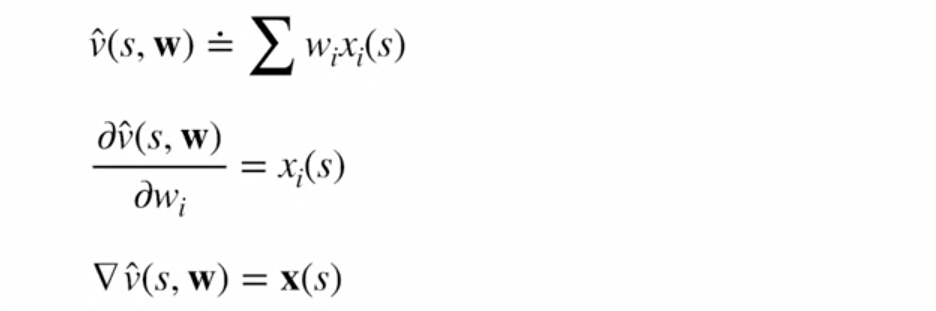

Algorithm and notable points:

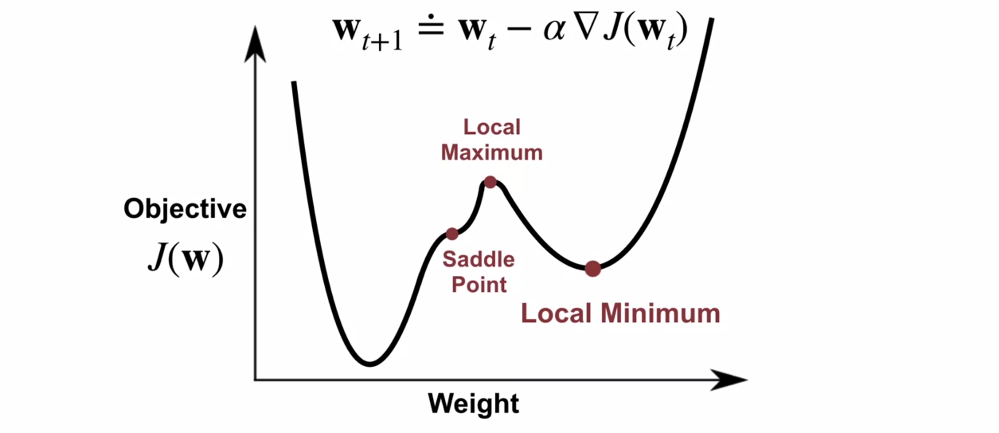

The objective is a function of $\hat v$, which in turn is a function of the weights, $\bf w$.

Here we assume a single weight in $\bf w$.

$\alpha$ takes a small step.  Moving in the direction of the negative gradient is only guaranteed to decrease the function value locally.

Other stationary points are local maxima and saddle points, which are unstable solutions.  The stochasticity in the data generally means we don't get stuck in these points, but rather in a stable local minima.

In some cases, convergence to the global minimum is guaranteed, eg linear functional approximation with MSVE descent.  Neural Networks don't guarantee global minima convergence.

A global minimum doesn't correspond to the true value funciton, rather the best approximation given the parameterised function and choice of objective.

#### Stochastic gradient descent

The first step in gradient descent is to find the gradient of the objective function:

Gradient of MSVE w.r.t. weights of the approximator

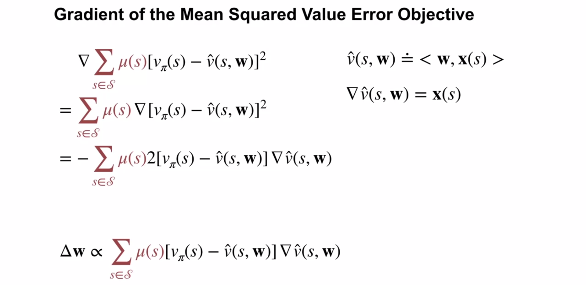

Top right of slide: for a linear (inner product) function, the gradient is the state feature vector (see above).

Recall chain rule: if $h = f\big(g(x)\big)$, then ${\displaystyle h'(x)=f'\big(g(x)\big) \cdot g'(x)}$

We are taking the gradient w.r.t. $\bf w$, so $v_\pi(s)$ is a constant and is ignored.

The negative in equation 3 comes from the $-\hat v(s, \mathbf w)$, and then is removed in the final equation to take a step down the gradient.

Final proportionality sanity check: Assume the derivative of the approximated value function is positive. This means that changing the weights in the positive direction will increase the approximated value function. If the difference between the actual and approximated value is also positive (meaning the estimate is low), then increasing the weights will decrease that difference, and locally minimises the MSVE.

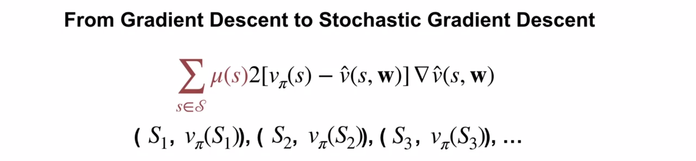

Summing over all states is generally not feasible, and we likely don't know the distrubution $\mu$.

We approximate the gradient given in the formula.

Imagine an idealised situation where we have access to $v_\pi$.  We don't need an explicit $\mu$ as we can sample states from it by following the policy.

A stochastic gradient is noisy approximation, but far cheaper to compute still makes overall progress towards a minimum.  The expectation of each stochastic gradient equals the gradient of the objective.

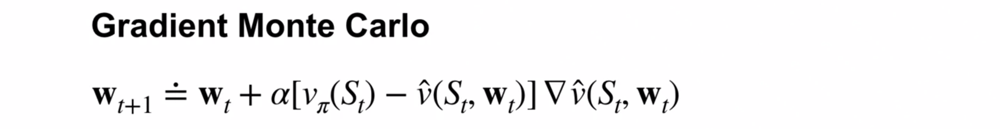

The problem with the above is that we don't have access to $v_\pi$, so we replace it with an estimate - the return from the state.

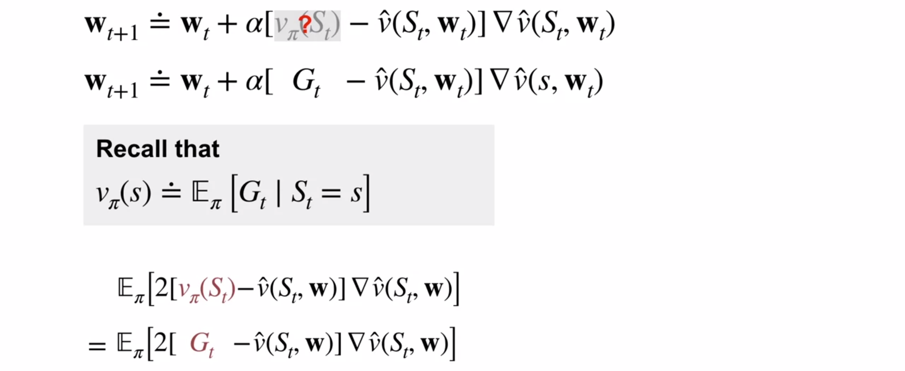

The expectation of the gradient based on the sample is exactly the same using the true state value.

The full algorithm:

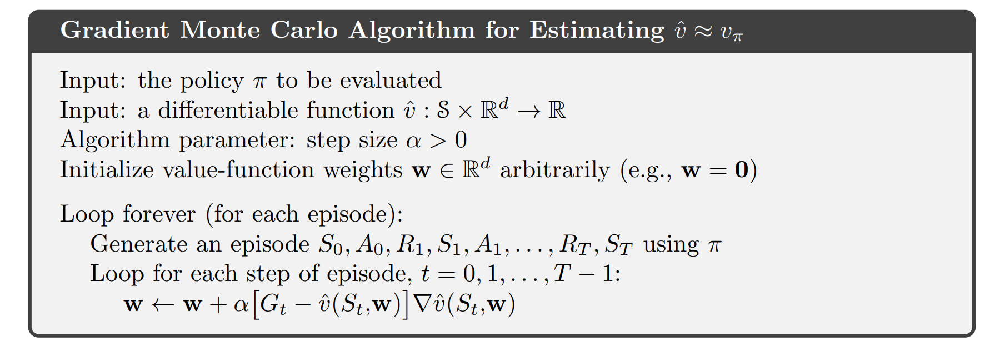

#### State aggregation and approximation

Imagine a random walk example: 1000 states, start in state 500 (the centre) and each transition moves uniform random between 1 and 100 states to either the left or right.

XXX

#### Apply Gradient Monte-Carlo with state aggregation

## TODO: complete notes for 9.3, 9.4

### Quiz
1 mem eff, generalising
2 teporary, laels change
3 in-out
4 all but MSVE linear
5 not unifor random
6 -,+,v pi
(S t ), v ^ (S t,w t )
7 not 2 in delta
8 minimize for all
9  not Gt.  Try the v(x, y)
10 all but below
11 all but below
12 not feat vec != weight vec

1) Tabular methods discriminate between different states perfectly, but do not generalize to similar states at all. We also want to use function approximation because we may be able to have  good discrimination and good generalization.

4) With a linear representation, the agent is unlikely to be able to perfectly represent the true values. This means that even the optimal linear value function approximation will incur squared error for some parts of the state space.

5) Even if the policy is uniformly random, the agent will not visit all states equally, so $\mu(s)$ will not be uniform.

7) In a Monte Carlo Update with function approximation, the 2 is included in the step-size, which we select and can scale by 2.

10) Stochastic gradient descent updates reduce the error for that particular input-output pair, but may increase the overall Mean Squared Value Error. However, the overall trend will be to decrease the Mean Squared Value Error until reaching a stationary point.

11) The weight vector corresponding to the TD fixed point does not achieve the local minimum, but a point near the local minimum of the Mean Squared Value Error.  The weight vector corresponding to the TD fixed point may not even be a stationary point of the Mean Squared Value Error.

12) The size of the feature vector is equal to the size of the weight vector.

## Lesson 3: The Objective for TD

Understand the TD-update for function approximation
Highlight the advantages of TD compared to Monte-Carlo
Outline the Semi-gradient TD(0) algorithm for value estimation
Understand that TD converges to a biased value estimate
Understand that TD converges much faster than Gradient Monte Carlo

## Lesson 4: Linear TD

Derive the TD-update with linear function approximation
Understand that tabular TD(0) is a special case of linear semi-gradient TD(0)
Highlight the advantages of linear value function approximation over nonlinear
Understand the fixed point of linear TD learning
Describe a theoretical guarantee on the mean squared value error at the TD fixed point
